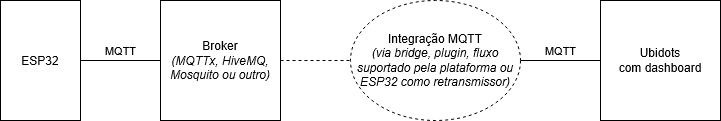
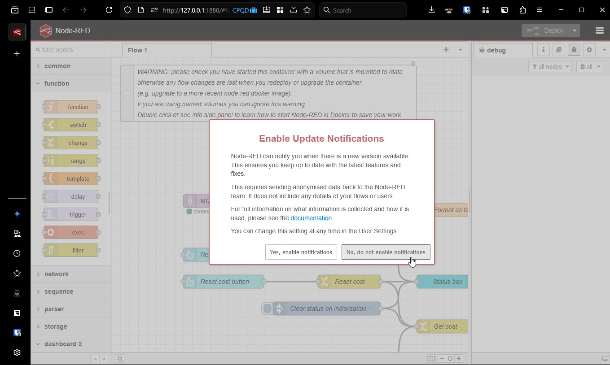

# PoC: Serviço de Temperatura por Localização

_Por: Cleber Akira Nakandakare_

- [PoC: Serviço de Temperatura por Localização](#poc-serviço-de-temperatura-por-localização)
  - [Introdução](#introdução)
    - [Enunciado da _Atividade 2 – Publicação de Telemetria do Dispositivo IoT (MQTT → Ubidots)_](#enunciado-da-atividade-2--publicação-de-telemetria-do-dispositivo-iot-mqtt--ubidots)
      - [Descrição da tarefa](#descrição-da-tarefa)
    - [Elaboração do sistema](#elaboração-do-sistema)
    - [Sistema elaborado: PoC - Serviço de Temperatura por Localização](#sistema-elaborado-poc---serviço-de-temperatura-por-localização)
  - [Implementação](#implementação)
    - [Visão geral](#visão-geral)
    - [Coleta de dados](#coleta-de-dados)
    - [Interface com o cliente](#interface-com-o-cliente)
      - [_Sliders_ de latitude e longitude](#sliders-de-latitude-e-longitude)
      - [Gatilho de requisição](#gatilho-de-requisição)
      - [Mapa](#mapa)
      - [Demais elementos do dashboard](#demais-elementos-do-dashboard)
    - [Aplicação Node-RED](#aplicação-node-red)
      - [Armazenamento de dados dos sensores](#armazenamento-de-dados-dos-sensores)
      - [Cálculo da temperatura e do custo](#cálculo-da-temperatura-e-do-custo)
      - [Inicialização e _reset_](#inicialização-e-reset)
    - [Mensagens MQTT](#mensagens-mqtt)
    - [Documentação](#documentação)
  - [Procedimentos de teste e resultados obtidos](#procedimentos-de-teste-e-resultados-obtidos)
    - [Obtendo os arquivos de programa](#obtendo-os-arquivos-de-programa)
    - [Carregar o programa Node-RED](#carregar-o-programa-node-red)
    - [Simular o ESP32 na plataforma Wokwi do VS Code](#simular-o-esp32-na-plataforma-wokwi-do-vs-code)
    - [Solicitar uma temperatura no Ubidots](#solicitar-uma-temperatura-no-ubidots)
    - [_Reset_ dos dados](#reset-dos-dados)
  - [Validação dos requisitos](#validação-dos-requisitos)
  - [Possíveis melhoria para o projeto](#possíveis-melhoria-para-o-projeto)
  - [Conclusão](#conclusão)

## Introdução

Este documento apresenta a solução da atividade entregável 2 do curso de "IoT em Sistemas Embarcados
2025/2026".

O repositório original de projeto pode ser encontrado em:
<https://github.com/cakira/IoT-Embarcados/>, e os dados relativos ao entregável
2 estão nesse mesmo repositório, na pasta
[entregavel_2](https://github.com/cakira/IoT-Embarcados/tree/main/entregavel_2).

### Enunciado da _Atividade 2 – Publicação de Telemetria do Dispositivo IoT (MQTT → Ubidots)_

#### Descrição da tarefa
**Ferramentas:** Wokwi + HiveMQ (ou outro broker MQTT) + Plataforma Ubidots + Sistema desejado para
Integração

1. Criar device no Ubidots (2 a 4 variáveis de telemetria a critério do estudante) - Pode
   reutilizar a Atividade 1 mas tente ser criativo melhorando o projeto anterior.
2. Configurar dashboard com widgets para o device criado - DICA: Como o Dashboard tem limite de
   10 Variaveis, pode usar variaveis de contexto para aumentar esse limite. Veja Aulas da Semana 6
3. No Wokwi, publicar telemetria MQTT em algum Broker (MQTTx, HiveMQ, Mosquito, etc)
4. No Ubidots, configurar integração MQTT usando Token do device/variáveis para consumir dados do
   Broker (via bridge, plugin, ou fluxo suportado pela plataforma, pode ser criado um outro sistema
   com ESP32 como retransmissor como ex. da Semana 7).
5. Validar se os dados do device estão atualizando no dashboard do Ubidots - Gere um relatorio
   (pode ser capturado do monitor serial) da origem dos dados e comparar com o resultado final.
   Acrescente na documentação.
6. Inserir print do dashboard atualizado na documentação
7. Criar uma documentação adequada mostrando um rascunho simples da arquitetura, objetivo do
   projeto, descrição geral do sistema, explicação de cada componente, seu fluxo de interação entre
   eles, descrição das variaveis de publicação e subscrição e conclusoes. Faça um documento formal
   com capa, titulo, indices, etc.
8. Fazer um pequeno video de poucos minutos mostrando o funcionamento dos sistemas, pode usar
   captura de tela.

### Elaboração do sistema

O enunciado pede para elaborar um sistema representado pelo diagrama abaixo, que também mostra onde
o protocolo MQTT precisa ser usado.

|  |
|:--:| 
| _Diagrama em blocos descrito no enunciado_ |

As linhas tracejadas representam a conexão e o bloco que foi deixado em aberto, a critério do aluno.

É fácil entender o interesse didático do sistema proposto, mas para que esse sistema tenha coerência
em uma aplicação real, imaginei um sistema em que o broker mais à esquerda possui dados que a
plataforma Ubidots não possui e a plataforma Ubidots solicita dados ao broker. Para ser mais
coerente, é preciso que o Ubidots não solicite exatamente os mesmos dados que o broker já possui,
mas sim, uma versão processada dos dados. Caso contrário, após algumas requisições, o Ubidots teria
o mesmo conjunto de dados que o broker e o broker se tornaria dispensável.

### Sistema elaborado: PoC - Serviço de Temperatura por Localização

Podemos imaginar este sistema como um serviço em que um cliente solicita a temperatura ambiente em
uma localização escolhida. A temperatura que o cliente recebe é inferida a partir de uma tabela com
algumas posições e a temperatura instantânea nessas posições, de forma que quando o cliente solicita
a temperatura em um ponto, o serviço usa fórmulas matemáticas para inferir a posição nesse ponto e
informa o cliente, além de também incrementar o acumulador de quanto aquelas requisições vão custar
ao cliente.

A figura abaixo apresenta o diagrama em blocos do sistema. Em comparação com diagrama em blocos
anterior, o diagrama abaixo define mostra três ESP32 do lado como entrada de dados de sensores,
define que o broker é a plataforma MQTTx, que a integração MQTT é feita pela plataforma Node-RED,
define o sentido do fluxo de dados e mostra que o protocolo entre o broker a o Node-RED é o MQTT.

|  |
|:--:| 
| _Diagrama em blocos do Serviço de Temperatura por Localização_ |

O enunciado não limita a tecnologia da integração MQTT (podendo ser "bridge, plugin, ou fluxo
suportado pela plataforma", ou um ESP32). Escolhi o Node-RED por interesse didáticos, com o objetivo
de aprender a usar a plataforma.

O sistema, tal qual está, é apenas uma PoC (_Proof of Concept_ - Prova de Conceito), pois a tabela
suporta apenas 3 posições e a inferência é feita usando a fórmula de um plano de álgebra linear.
Contudo, com a substituição da fórmula, o sistema poderia ser expandido para usar mais pontos e
também para informar outros dados, como umidade do ar, índice de poluição, ou pressão atmosférica.
O custo para o cliente também está bastante simplificado, apenas incrementando em $0,01 a cada
requisição.

Apesar dessas limitações, o sistema é válido como prova de conceito e também implementa o sistema
requisitado pela atividade do curso.

As próximas seções detalham a implementação, apresentam como executar o sistema e os resultados,
verificam se os requisitos da atividade foram cumpridos e apresentam ideias de melhoria para o
sistema. O relatório encerra com uma breve conclusão.

## Implementação

### Visão geral
Este sistema pode ser dividido em três partes:

1. Coleta de dados: esta parte, que contém os sensores microprocessados e o broker MQTTx, coleta
   dados e os envia para o servidor MQTTx.
2. Interface com o cliente: esta parte, que inclui um _dashboard_ no Ubidots e o broker do próprio
   Ubidots, tem a interface para o cliente fazer a requisição, apresenta em um mapa a temperatura
   informada pelo sistema e também apresenta o custo para o cliente.
3. Aplicação Node-RED: é o coração do sistema, ela armazena os dados dos sensores, identifica quando
   o cliente faz a requisição, calcula a temperatura na localização escolhida, e faz a conta de
   quanto o cliente deve pagar.

A seguir, este documento apresento cada uma dessas partes e termina com uma seção descrevendo os
tópicos MQTT utilizados.

### Coleta de dados

Neste sistema, três placas sensoras enviam dados de temperatura ambiente e localização para o broker
MQTTx. Foi determinado que haveria apenas três placas pois o método de inferência de temperatura se
tornaria muito mais complexo com quatro ou mais placas.

Utilizei o microcontrolador ESP32 simulado pelo site Wokwi.com, como usado constantemente no curso.
Para medir a temperatura, usei um sensor do tipo NTC. Para a localização, como não havia um
componente GPS disponível no Wokwi.com, defini a posição manualmente, para cada um dos sensores, da
seguinte forma:

| **Identificação** | **Latitude** | **Longitude** | **Descrição** |
| ----------------- | ------------ | ------------- | ------------- |
| Sensor 0          | -22.8162268  | -47.0451902   | Localização do CPQD |
| Sensor 1          | -22.9027350  | -47.0563132   | Localização da FIAP |
| Sensor 2          | -22.8517996  | -47.1284529   | Localização do [CTI](https://www.gov.br/cti/pt-br) |

Inseri um _DIP-switch_ para fazer a seleção dos sensores, como pode ser visto na figura abaixo.

|  |
|:--:| 
| _ESP32 usado como sensor de temperatura_ |

Como descrito na figura, as chaves 7 e 8 configuram a identificação do sensor. Essa configuração só
é aceita durante a inicialização do dispositivo, uma vez que não faz sentido uma atualização
dinâmica da identificação.

O ESP32 coleta os dados de temperatura e envia para o broker MQTTx a cada 2 segundos.

Abaixo, podemos ver um exemplo do que é impresso na porta serial do Wokwi, para o sensor 1. Os
sensores 0 e 2 são muito semelhantes, ao 1, exceto sua identificação.

```
rst:0x1 (POWERON_RESET),boot:0x13 (SPI_FAST_FLASH_BOOT)
configsip: 0, SPIWP:0xee
clk_drv:0x00,q_drv:0x00,d_drv:0x00,cs0_drv:0x00,hd_drv:0x00,wp_drv:0x00
mode:DIO, clock div:2
load:0x3fff0030,len:1156
load:0x40078000,len:11456
ho 0 tail 12 room 4
load:0x40080400,len:2972
entry 0x400805dc


*
* Program start
*
[CONF] Device ID: 1
[WiFi] Connecting to Wokwi-GUEST..
[WiFi] Connected!
[MQTT] Connecting to Ubidots... Connected!
[SENS] Current temperature: 24.00.C
[MQTT] Topic: IoT-Embarcados/akira/entrega/2/sensor/1
[MQTT] Payload: {"lat": -22.902735, "lon": -47.056313, "temp": 24.00}
[SENS] Current temperature: 31.99.C
[MQTT] Topic: IoT-Embarcados/akira/entrega/2/sensor/1
[MQTT] Payload: {"lat": -22.902735, "lon": -47.056313, "temp": 31.99}
[SENS] Current temperature: 28.31.C
[MQTT] Topic: IoT-Embarcados/akira/entrega/2/sensor/1
[MQTT] Payload: {"lat": -22.902735, "lon": -47.056313, "temp": 28.31}
[SENS] Current temperature: 28.31.C
[MQTT] Topic: IoT-Embarcados/akira/entrega/2/sensor/1
[MQTT] Payload: {"lat": -22.902735, "lon": -47.056313, "temp": 28.31}
```

### Interface com o cliente

Como especificado no enunciado do exercício, criei um _dashboard_ com a interface do cliente. Para
solicitar a temperatura, é preciso selecionar a posição —latitude e longitude— e
então enviar a solicitação ao Node-RED.

Para fazer a requisição, criei o dispositivo _"Temperature Requester"_ e adicionei nele três
variáveis manualmente:

* req_lat - latitude da requisição, numérico;
* req_lon - longitude da requisição, numérico;
* req_run - gatilho da requisição, numérico, mas seu valor não importa, desde que ele mude.

Idealmente, seria possível enviar tanto a localização como a requisição em uma única mensagem MQTT.
Contudo, o Ubidots não consegue não consegue agregar os dados no MQTT e, por isso ele envia uma
mensagem para a latitude, uma para a longitude e outra para o gatilho.

Ao receber a resposta via MQTT, o Ubidots cria automaticamente duas variáveis nesse mesmo
dispositivo, baseado no tópico MQTT que chega:

* cost - variável numérica com o custo acumulado do serviço
* position - apesar do nome, esta variável contém tanto a posição como a temperatura ambiente

A figura abaixo mostra o dispositivo _"Temperature Requester"_, já com as 5 variáveis descritas
acima.

|  |
|:--:| 
| _Dispositivo "Temperature Requester" no Ubidots_ |

Já a figura abaixo mostra o _dashboard_ do Ubidots para fazer a requisição, já com algumas
respostas:

|  |
|:--:| 
| _Dashboard no Ubidots_ |

Para aumentar a usabilidade do dashboard, fiz algumas customizações dignas de nota:

#### _Sliders_ de latitude e longitude
Na falta de alternativa melhor, o sistema utiliza _sliders_ para entrar com a latitude e longitude.
Porém, como pode-se ver na seção anterior ([Coleta de dados](#coleta-de-dados)), a variação entre os
valores máximo e mínimo, tanto de latitude, como de longitude, é pequena:

* latitude:
  * máxima: -22.8162268°
  * mínima: -22.9027350°
* longitude:
  * máxima: -47.0451902°
  * mínima: -47.1284529°

Assim, os valores padrão dos sliders, de 0 a 100 não são adequados. Limitei esses valores à faixa
entre -22.81° e -22.91° para latitude e à faixa entre -47.04° e -47.13° para longitude, ambas com
passo de 0.001°. Além disso, coloquei o slider de latitude na vertical e o slider de longitude na
horizontal, para uniformizar com a visão de mapas mais comum, onde o norte está em cima.

#### Gatilho de requisição
O Ubidots disponibiliza um controle chamado _switch_, que permite alternar uma variável entre os
valores 0 e 1. Esse controle muda a cor e o texto apresentado conforme o valor selecionado. Contudo,
neste caso, o valor não é importante, mas sim a mudança e, por isso, editei o controle de forma que
ele tivesse a mesma cor, independente do seu valor, e suprimi o texto apresentado.

#### Mapa
Este foi o elemento mais difícil de customizar no _dashboard_, sendo necessário ler toda a
documentação dele, presente em
<https://help.ubidots.com/en/articles/1712418-create-map-widgets-in-ubidots>. 

O que tornou seu uso particularmente difícil foi o fato dele não usar uma hierarquia de variáveis
simples, mas sim uma que classifica a latitude e a longitude como propriedades dentro de um contexto
dentro de uma variável que contém o dado de temperatura.

Mas, quando consegui formatar a variável conforme o modelo esperado, o mapa passou a funcionar como
esperado. O formato da variável MQTT será melhor mostrada na seção
[Mensagens MQTT](#mensagens-mqtt).

Dado que o mapa é o elemento mais chamativo do dashboard, achei interessante adicionar algumas
referências nele para deixá-lo mais intuitivo de compreender. Para isso, criei dois outros
dispositivos: CPQD e FIAP, conforme pode ser visto na figura abaixo:

|  |
|:--:| 
| _Lista de dispositivos no Ubidots_ |

O único objetivo deles é inserir referências visuais no mapa. Configurei suas posições conforme a
posição real (descrita na tabela da seção [Coleta de dados](#coleta-de-dados)) e inseri-os no mapa,
como pode ser visto na figura abaixo, em que a antena vermelha assinala a posição do CPQD e o prédio
vermelho, supostamente uma escola, assinala a posição da FIAP. Não foi possível inserir mais
marcadores pois a versão gratuita do Ubidots não permite criar mais do que 3 dispositivos.

|  |
|:--:| 
| _Marcadores no mapa do Ubidots_ |

#### Demais elementos do dashboard
Um indicador de temperatura e um texto com o valor a ser pago completam o _dashboard_. Apesar de
serem elementos importantes, sua criação e funcionamento são de entendimento trivial.

### Aplicação Node-RED

O Node-RED é uma ferramenta de programação visual baseada em fluxos. Similar a outras linguagens de
programação, ele é muito flexível, e pode ser usado para incontáveis finalidades. No meu caso
específico, como eu não tenho familiaridade com a ferramenta, foi uma oportunidade didática.

Usando o Node-RED, construí a interface de usuário mostrado na figura abaixo. Esse _dashboard_ é
diferente do _dashboard_ do Ubidots, pois o Node-RED apresenta as informações de mais baixo nívels
dos dados, diretamente dos sensores. O _dashboard_ do Node-RED também dá acesso a comandos de
administrador do sistema, como apagar os dados dos sensores e zerar o custo.

|  |
|:--:| 
| _Dashboard no Node-RED_ |

O diagrama do fluxo que controla esses dados está representado abaixo:

|  |
|:--:| 
| _Diagrama de fluxo no Node-RED_ |

Para facilitar a compreensão do fluxo, ele será apresentado em partes.

#### Armazenamento de dados dos sensores

|  |
|:--:| 
| _Diagrama de fluxo no Node-RED: Dados dos sensores_ |

Sempre que um dado de sensor novo chega no broker MQTT, ele é lido pelo Node-RED e armazenado em uma
variável chamada `sensorData` do tipo vetor. Em seguida, a variável `sensorData` é formatada e
apresentada em uma tabela.

O código javascript do nó `Store in sensorData` está abaixo. Podemos ver que ele armazena os dados
em `flow['sensorData']`.

```javascript
// The topic comes in as ".../sensor/1", ".../sensor/2", etc.
// We split the string to get the ID "1", "2", or "3"
var sensorID = msg.topic.split("/").at(-1);

// We get the current list of sensors from memory (or create an empty one)
var sensors = flow.get('sensorData') || {};

// We save the payload (lat, lon, temp) into this object
sensors[sensorID] = msg.payload;

// Write it back to memory
flow.set('sensorData', sensors);

// We don't return anything because this is just storage.
msg.payload = true;
return msg;
```

E o código javascript do nó `Format as table` é:
```javascript
var sensors = flow.get('sensorData') || {};
var tableArray = [];

// Loop through each sensor ID ("1", "2", "3"...)
// and push the object into the array
for (var id in sensors) {
    if (sensors.hasOwnProperty(id)) {
        var data = sensors[id];

        tableArray.push({
            "Sensor": id,
            "Latitude": data.lat,
            "Longitude": data.lon,
            "Temp (°C)": data.temp
        });
    }
}

// The user interface widget expects data in msg.payload
msg.payload = tableArray;
return msg;
```


#### Cálculo da temperatura e do custo

|  |
|:--:| 
| _Diagrama de fluxo no Node-RED: Cálculo da temperatura e custo_ |


Também através do protocolo MQTT, o Node-RED fica monitorando as variáveis de latitude, longitude e
gatilho no Ubidots (respectivamente chamados de `req_lat`, `req_lon` e `req_run`, como pode ser
visto na seção anterior [Interface com o cliente](#interface-com-o-cliente)). Quando a latitude ou a
longitude são alteradas o Node-RED os armazena em variáveis internas, como pode ser visto no código
dos nós:

Código do nó `Store latitude`:
```javascript
flow.set('requested_latitude', msg.payload);
```

Código do nó `Store longitude`:
```javascript
flow.set('requested_longitude', msg.payload);
```

Já o código do nó `Calc temperature` é bem mais complexo, pois ele recupera os dados dos sensores,
calcula a temperatura, usando fórmulas de geometria analítica, incrementa o custo e formata a
mensagem a ser enviada via MQTT como resposta para o Ubidots. As fórmulas de geometria analítica
não levam em conta a curvatura da Terra, então elas só funcionam para localizações próximas entre
si e longe dos pólos. Felizmente, é o nosso caso.

Código do nó `Calc temperature`:
```javascript
var sensors = flow.get('sensorData');

if (!sensors || !sensors["0"] || !sensors["1"] || !sensors["2"]) {
    msg.payload = { error: "Data still unavailable. Try again in a few minutes" };
    return msg;
}

// ------------------------------
// THE GEOMETRY (Plane Equation)
// ------------------------------

// Get the User's requested location
var requestedX = flow.get('requested_latitude');
var requestedY = flow.get('requested_longitude');

if (!requestedX || !requestedY) {
    msg.payload = { error: "Missing latitude or longitude" };
    return msg;
}

// We define our 3 points (x=lat, y=lon, z=temp)
// Point 1
var x0 = sensors["0"].lat;
var y0 = sensors["0"].lon;
var z0 = sensors["0"].temp;

// Point 2
var x1 = sensors["1"].lat; 
var y1 = sensors["1"].lon; 
var z1 = sensors["1"].temp;

// Point 3
var x2 = sensors["2"].lat; 
var y2 = sensors["2"].lon; 
var z2 = sensors["2"].temp;

// Calculate 2 Vectors (V1 = P2-P1, V2 = P3-P1)
var v1x = x1 - x0; var v1y = y1 - y0; var v1z = z1 - z0;
var v2x = x2 - x0; var v2y = y2 - y0; var v2z = z2 - z0;

// Calculate Normal Vector (Cross Product: V1 x V2)
// This gives us the coefficients (a, b, c) for the plane equation: ax + by + cz + d = 0
var a = (v1y * v2z) - (v1z * v2y);
var b = (v1z * v2x) - (v1x * v2z);
var c = (v1x * v2y) - (v1y * v2x);

// Solve for Z (Temperature) at the target (x, y)
// Formula: z = z0 - ( a*(x - x0) + b*(y - y0) ) / c

var estimatedTemp = 0;

if (c === 0) {
     // This happens if points are colinear (straight line) - cannot form a plane
     node.warn("Error: Sensors are in a straight line, cannot calculate plane.");
     estimatedTemp = null;
} else {
     var dx = requestedX - x0;
     var dy = requestedY - y0;
     estimatedTemp = z0 - ( (a * dx) + (b * dy) ) / c;
}

// Increase de cost
var pricePerRequest = 0.01;
var cost = flow.get('cost') || 0;
cost += pricePerRequest;
cost = Number(cost.toFixed(2)); // avoid precision errors
flow.set('cost', cost);


// Create the response message for the MQTT publish
msg.payload = {
    "position": {
        "value": estimatedTemp,
        "context": {
            "lat": requestedX,
            "lng": requestedY
        },
    }
};

return msg;
```

Além da temperatura, o cálculo da temperatura ativa os nós que enviam o custo para o Ubidots com uma
outra mensagem MQTT. Note que o nó `Get cost` recupera o custo da memória, sem usar nenhuma
informação vinda do nó imediatamente anterior. Neste caso, o fluxo só é utilizado para definir a
ocasição de acionamento desses nós. Como pode ser visto no diagrama completo, o nó `Get cost` é
acionado na sequência de qualquer um dos nós `Reset cost`, `Clear status on initialization`, ou
`Calc temperature`.

#### Inicialização e _reset_

|  |
|:--:| 
| _Diagrama de fluxo no Node-RED: Inicialização e reset_ |

Essa parte do código é ligada aos botões de _reset_ do _dashboard_ do Node-RED, de forma que quando
um dos botões é pressionado, a variável correspondente é apagada e uma mensagem de status é
apresentada no _dashboard_.

### Mensagens MQTT

A tabela abaixo lista as mensagens MQTT utilizadas.

| **Broker** | **Publicador (Origem)** | **Subscritor (Destino)** | **Tópico** | **Exemplo de mensagem** | **Descrição** |
| ---------- | ----------- | - | - | - | - |
| MQTTx | Sensor ESP32 | Node-RED | _\<M>_`sensor/`_\<id>_ | `{"lat": -22.902735, "lon": -47.056313, "temp": 28.31}` | Dados dos sensores |
| Ubidots | Ubidots (Slider V) | Node-RED | _\<U>_`/temperature-requester/req_lat/lv` | `-22.851` | Latitude da requisição |
| Ubidots | Ubidots (Slider H) | Node-RED | _\<U>_`/temperature-requester/req_lon/lv` | `-47.094` | Longitude da requisição |
| Ubidots | Ubidots (Botão) | Node-RED | _\<U>_`/temperature-requester/req_run/lv` | `1` | Gatilho da requisição, note que seu valor não importa |
| Ubidots | Node-RED  | Ubidots (Mapa) | _\<U>_`/temperature-requester` | `{"position": {"value": 23.88, "context": {"lat": -22.851, "lng": -47.094}}` | Resposta da requisição |
| Ubidots | Node-RED  | Ubidots (Display) | _\<U>_`/temperature-requester/cost` | `3.14` | Custo |

**Nota:**
  * _\<id>_ se refere à identificação do sensor, que pode ser `0`, `1` ou `2`.
  * _\<M>_ se refere ao prefixo `IoT-Embarcados/akira/entrega/2`, usado no MQTTx.
  * _\<U>_ se refere ao prefixo `/v1.6/devices/`, usado no Ubidots.

Para se conectar ao servidor Ubidots, é necessário usar o token de acesso do dispositivo. Esse token
é inserido no lugar do _username_ e a senha é deixada em branco.

### Documentação

Apesar da documentação não fazer parte da implementação, convém registrar, para possíveis
referências futuras, que este documento está sendo elaborado no formato Markdown, que o sumário
está sendo criado com o plugin "Markdown All in One" e que ele está sendo transformado em PDF com 
o plugin "Markdown PDF", ambos do VS Code.

Os diagramas em blocos foram elaborados no site <https://www.drawio.com/> e suas fontes estão
disponibilizados na pasta docs, com a extensão .drawio.

## Procedimentos de teste e resultados obtidos

As próximas subseções apresentam o procedimento para testar o programa e os resultados obtidos.
Recomenda-se que eles sejam executados na ordem apresentada.

Nesses procedimentos, o mais difícil é lidar com o Ubidots, pois os dispositivos e o _dashboard_
da versão gratuita não podem ser compartilhados. Contudo, um usuário que já conhece o Ubidots será
capaz de reproduzir o dispositivo e o _dashboard_ com base no que foi apresentado na seção
[Interface com o cliente](#interface-com-o-cliente).

### Obtendo os arquivos de programa

Em um terminal de linha de comando, baixe os arquivos do repositório e navegue até a pasta do
projeto:

```bash
git clone https://github.com/cakira/IoT-Embarcados/
cd IoT-Embarcados/entregavel_2
```

### Carregar o programa Node-RED

**Pré-requisito:** Docker instalado e configurado para execução sem `sudo`.

1. **Instalação de Dependências (Apenas na primeira execução):** O projeto utiliza o plugin
   _FlowFuse Dashboard_, que deve ser instalado no volume de dados local antes de iniciar o serviço.
   Para isso, digite em uma janela de comando:

```bash
docker run -it --rm -p 1880:1880 \
    --mount type=bind,src=$PWD/data_node_red,dst=/data \
    --entrypoint /bin/bash \
    nodered/node-red:4.1.3 \
    -c "cd /data && npm install @flowfuse/node-red-dashboard@1.30.2"
```

   O resultado pode ser visto abaixo:

|  |
|:--:| 
| _Terminal de com comandos para carregamento do Node-RED - 1 de 2_ |

2. **Execução do Node-RED:** Com o plugin instalado, execute o container para subir o serviço:

```bash
docker run -it --rm -p 1880:1880 \
    --mount type=bind,src=$PWD/data_node_red,dst=/data \
    nodered/node-red:4.1.3
```

**Notas importantes:**
* **Persistência:** O uso da flag `--rm` garante que o container seja removido ao encerrar
  (economizando espaço em disco), mas suas configurações e fluxos são preservados na pasta local
  `data_node_red` através do bind mount.
* **Versão:** O projeto foi validado no Node-RED versão 4.1.3. Para testar versões mais recentes,
  substitua a tag `4.1.3` do comando anterior por `latest`.
* **Execução:** O sistema inicializa automaticamente assim que o comando docker acima é executado,
  de forma que as etapas abaixo não são essenciais para ativação do Node-RED.

3. Use seu navegador para acessar o endereço <http://127.0.0.1:1880/dashboard>.  
   Inicialmente o _dashboard_ do Node-RED está vazio.

4. Caso haja interesse, a visão de fluxos do Node-RED está disponível no endereço
   <http://127.0.0.1:1880>.  
   Pode-se ir passando as mensagens boas-vindas até que a visão dos fluxos esteja disponível.  
   Não é necessário alterar nenhum fluxo.
   
|  |
|:--:| 
| _Terminal de com comandos para carregamento do Node-RED - 2 de 2_ |

|  |
|:--:| 
| _Dashboard do Node-RED recém inicializado_ |

|  |
|:--:| 
| _Mensagem de boas-vindas do Node-RED_ |

|  |
|:--:| 
| _Visão fluxo do Node-RED_ |

### Simular o ESP32 na plataforma Wokwi do VS Code

1. Já tendo o PlatformIO e o Wokwi instalados no VS Code, carregue a pasta
   `IoT-Embarcados/entregavel_2` no VS Code.
2. Altere as posições das chaves 7 e 8 do _DIP-Switch_ para que elas representem o ID 0 (`OFF`,
   `OFF`).
3. Inicie o simulador e acompanhe as mensages de status na porta serial.
4. Altere a temperatura no NTC para a temperatura que desejar.
5. Confirme na porta serial que a temperatura desejada foi enviada ao _broker_.
6. Interrompa a simulação.
7. Repita o passo 2, mas posicionando as chaves para que elas representem o ID 1 (`OFF`, `ON`).
8. Repita os passos de 3 a 6.
7. Repita o passo 2, mas posicionando as chaves para que elas representem o ID 2 (`ON`, `OFF`).
8. Repita os passos de 3 a 6.

A figura abaixo mostra o ambiente de simulação do ESP32 no Wokwi. Na parte inferior, é possível ver
as mensagens de status da porta serial.

|  |
|:--:| 
| _Simulação do ESP32_ |

Caso tenha interesse, os 3 sensores ESP32 podem ser simulados simultaneamente, cada um em sua
própria janela do VS Code.

Caso o Node-RED já tenha sido carregado e esteja em execução como descrito na seção anterior
[Carregar o programa Node-RED](#carregar-o-programa-node-red), os valores dos sensores pode ser
acompanhados no _dashboard_ do Node-RED, como mostrado nas figuras abaixo.

|  |
|:--:| 
| _Dashboard do Node-RED com o registro de um sensor_ |

|  |
|:--:| 
| _Dashboard do Node-RED com o registro dos três sensores_ |

### Solicitar uma temperatura no Ubidots

**Importante:** os dispositivos apresentados e o _dashboard_ estão atrelados à conta de usuário,
mas é possível reproduzí-los usando o apresentado na seção
[Interface com o cliente](#interface-com-o-cliente). Após isso, é preciso obter o novo token do
dispositivo e usá-lo no campo "User" do server "Ubidots" no Node-RED.ls m

No _dashboard_ do Ubidots:

1. Usar o slider vertical para selecionar uma latitude.
2. Usar o slider horizontal para selecionar uma longitude.
3. Clicar no botão redondo para disparar uma requisição de temperatura.
4. Observar o resultado:
   1. a localização é mostrada no mapa
   2. a temperatura é mostrada no símbolo de termómetro
   3. o custo acumulado também é mostrado

A figura abaixo mostra o resultado, já com as etapas acima destacadas.

|  |
|:--:| 
| _Resultado de uma requisição no dashboard do Ubidots_ |

A figura abaixo mostra o resultado após algumas requisições. Como o custo está aumentando em $0,01
por requisição, é fácil saber que esse é o resultado após 7 requisições. O Ubidots traça em azul
o percurso que os pontos fizeram no mapa.

|  |
|:--:| 
| _Dashboard do Ubidots após 7 requisições_ |

Para fins de conferência, a figura abaixo mostra à direita as mensagens de debug no Node-RED
correspondentes à ultima requisição de temperatura. Comparando a temperatura e o custo das mensagens
da figura abaixo com as informações apresentadas no _dashboard_ da figura acima, podemos verificar
que as mensagens enviadas pelo Node-RED efetivamente foram apresentadas no _dashboard_ do Ubidots.

|  |
|:--:| 
| _Mensagens enviadas do Node-RED para o Ubidots_ |

### _Reset_ dos dados

Por fim, executamos a ação administrativa de _reset_ dos dados, clicando nos botões _Reset Sensor_
_Data_ e _Reset Request Counter_. Como podemos ver na figura abaixo, os dados dos sensores são
removidos do _dashboard_ do Node-RED e o _Cost_ é zerado. Além disso, logo abaixo do botão, é
impressa uma mensagem de status _Counter reset_.

|  |
|:--:| 
| _Reset dos dados no dashboard do Node-RED_ |

A figura abaixo mostra que o custo foi zerado no _dashboard_ do Ubidots também.

|  |
|:--:| 
| _Custo no dashboard do Ubidots após um reset_ |

## Validação dos requisitos

Não foram definidos requisitos formais para esta atividade, mas sim tarefas do enunciado. Abaixo
está um resumo das tarefas definidas em [Descrição da tarefa](#descrição-da-tarefa), acompanhada
pelo símbolos:

* ✅ - indica que a tarefa foi cumprida integralmente
* ✔️ - indica que a tarefa foi cumprida parcialmente

Eventuais comentários estão em _itálico_ abaixo da descrição da tarefa.

1. ✅ Criar devices no Ubidots com 2 a 4 variáveis de telemetria
2. ✅ Configurar dashboard com widgets para o device criado
3. ✅ No Wokwi, publicar telemetria MQTT em algum Broker
4. ✅ No Ubidots, configurar integração MQTT usando Token do device/variáveis para consumir dados do
   Broker
5. ✅ Validar se os dados do device estão atualizando no dashboard do Ubidots. Gere um relatório da
   origem dos dados e comparar com o resultado final. Acrescente na documentação.  
   _Essa validação pode ser vista comparando as duas últimas imagems da seção anterior_
   _[Solicitar uma temperatura no Ubidots](#solicitar-uma-temperatura-no-ubidots)_
6. ✅ Inserir print do dashboard atualizado na documentação
7. ✔️ Criar uma documentação adequada mostrando um rascunho simples da arquitetura, objetivo do
   projeto, descrição geral do sistema, explicação de cada componente, seu fluxo de interação entre
   eles, descrição das variaveis de publicação e subscrição e conclusões. Faça um documento formal
   com capa, titulo, indices, etc.  
   _Completado, com exceção de que o documento não possui capa._
8. ✅ Fazer um pequeno video de poucos minutos mostrando o funcionamento dos sistemas, pode usar
   captura de tela.

## Possíveis melhoria para o projeto

Segue abaixo uma lista de possíveis melhorias para o projeto. Essa lista não é exaustiva, mas serve
de referência, listando limitações que foram percebidas durante o desenvolvimento.

* Adotar testes automatizados, como testes unitários ou testes de integração.
* Usar o protocolo MQTTS (MQTT over SSL/TLS) ao invés do MQTT como atualmente.
* Possibilitar a expansão do número de sensores, para mais que 3.
* Possibilitar o uso de outras grandezas, como umidade ou poluição, ao invés de usar apenas
  temperatura.
* Possibilitar mais de um cliente, deixando claro permissões de cada tipo de usuário ou
  administrador do sistema.
* Apresentar mensagens de erro no Ubidots, por exemplo, quando se tenta fazer uma requisição sem que
  os dados dos sensores estejam disponíveis.
* Substituir as localizações fixa por coordenadas obtidas de um GPS.
* Usar a curvatura da Terra nos cálculos, sobretudo para distâncias significativas.

## Conclusão

Este projeto teve 3 objetivos:

1. Completar a atividade do curso de "IoT em Sistemas Embarcados"
2. Adquirir mais familiaridade com a ferramenta Node-RED
3. Criar uma PoC (Prova de Conceito) de um sistema que poderia, com as devidas melhorias, ser útil
   em um caso real, pensando no cenário de _start-ups_.

O objetivo 1 foi cumprido, como mostrado na seção
[Validação dos requisitos](#validação-dos-requisitos).

O objetivo 2 foi cumprido, sendo que aprendi:
* A instanciar um container docker com o Node-RED mais recente.
* Acrescentar nós que recebem e publicam mensagens MQTT
* Criar nós com funções Javascript. Para esta função, foi preciso recorrer ao auxílio de ferramentas
  de inteligência artificial, mas mesmo assim, olhei o código gerado e pude aprender como ele
  funciona.
* Como armazenar dados dentro de variáveis do Node-RED.
* Como criar um _dashboard_ no Node-RED.
* Como fazer o armazenamento de projetos do Node-RED dentro de um repositório git.
* Como instalar pluggins, tanto através do _Palette Manager_ como através do comando `npm`.

O objetivo 3 é subjetivo, sendo que é preciso de experiência e de intuição para afirmar se ele é ou
não útil em um caso real. Contudo, é evidente que, consideradas as limitações de uma prova de
conceito, o sistema realiza aquilo a que ele se propõe sem nenhuma falha observada até o momento.

Portanto, podemos assumir que este projeto atingiu todos os objetivos propostos.
