# PoC: Serviço de Temperatura por Localização

_Por: Cleber Akira Nakandakare_

- [PoC: Serviço de Temperatura por Localização](#poc-serviço-de-temperatura-por-localização)
  - [Introdução](#introdução)
    - [Enunciado da Atividade](#enunciado-da-atividade)
  - [Arquitetura da Solução](#arquitetura-da-solução)
    - [Conceito: Serviço de Temperatura sob Demanda](#conceito-serviço-de-temperatura-sob-demanda)
    - [Diagrama em Blocos](#diagrama-em-blocos)
  - [Implementação](#implementação)
    - [1. Coleta de Dados](#1-coleta-de-dados)
    - [2. Interface com Cliente (Ubidots)](#2-interface-com-cliente-ubidots)
      - [Customizações do _Dashboard_](#customizações-do-dashboard)
    - [3. Aplicação Node-RED (Integração e Lógica)](#3-aplicação-node-red-integração-e-lógica)
      - [Gerenciamento de Estado (Armazenamento de Dados)](#gerenciamento-de-estado-armazenamento-de-dados)
      - [Lógica de Aplicação (Cálculo e Custo)](#lógica-de-aplicação-cálculo-e-custo)
      - [Inicialização e Reset](#inicialização-e-reset)
    - [Mapeamento de Tópicos MQTT](#mapeamento-de-tópicos-mqtt)
    - [Documentação](#documentação)
  - [Procedimentos de Teste e Resultados](#procedimentos-de-teste-e-resultados)
    - [Obtendo os Arquivos](#obtendo-os-arquivos)
    - [Carregar o Node-RED](#carregar-o-node-red)
    - [Simular o ESP32 (Wokwi)](#simular-o-esp32-wokwi)
    - [Solicitar uma Temperatura (Ubidots)](#solicitar-uma-temperatura-ubidots)
    - [Reset dos Dados](#reset-dos-dados)
  - [Validação dos Requisitos](#validação-dos-requisitos)
  - [Possíveis Melhorias](#possíveis-melhorias)
  - [Conclusão](#conclusão)

---

## Introdução

Este documento apresenta a solução da atividade entregável 2 do curso de "IoT em Sistemas Embarcados 2025/2026".

O código-fonte completo e os artefatos do projeto estão disponíveis no repositório:
<https://github.com/cakira/IoT-Embarcados/tree/main/entregavel_2>.

### Enunciado da Atividade

> **Ferramentas:** Wokwi + HiveMQ (ou outro broker MQTT) + Plataforma Ubidots + Sistema desejado para Integração
>
> 1. Criar device no Ubidots (2 a 4 variáveis de telemetria a critério do estudante) - Pode reutilizar a Atividade 1 mas tente ser criativo melhorando o projeto anterior.
> 2. Configurar dashboard com widgets para o device criado - DICA: Como o Dashboard tem limite de 10 Variaveis, pode usar variaveis de contexto para aumentar esse limite. Veja Aulas da Semana 6
> 3. No Wokwi, publicar telemetria MQTT em algum Broker (MQTTx, HiveMQ, Mosquito, etc)
> 4. No Ubidots, configurar integração MQTT usando Token do device/variáveis para consumir dados do Broker (via bridge, plugin, ou fluxo suportado pela plataforma, pode ser criado um outro sistema com ESP32 como retransmissor como ex. da Semana 7).
> 5. Validar se os dados do device estão atualizando no dashboard do Ubidots - Gere um relatorio (pode ser capturado do monitor serial) da origem dos dados e comparar com o resultado final. Acrescente na documentação.
> 6. Inserir print do dashboard atualizado na documentação
> 7. Criar uma documentação adequada mostrando um rascunho simples da arquitetura, objetivo do projeto, descrição geral do sistema, explicação de cada componente, seu fluxo de interação entre eles, descrição das variaveis de publicação e subscrição e conclusoes. Faça um documento formal com capa, titulo, indices, etc.
> 8. Fazer um pequeno video de poucos minutos mostrando o funcionamento dos sistemas, pode usar captura de tela.

## Arquitetura da Solução

Para atender ao enunciado de forma coerente com uma aplicação real, imaginei um cenário onde o Ubidots não apenas recebe dados passivamente, mas atua como cliente de um serviço.

### Conceito: Serviço de Temperatura sob Demanda

O sistema simula um serviço onde o usuário solicita a temperatura estimada para uma localização específica. Se o Ubidots solicitasse exatamente os mesmos dados brutos que o _broker_ já possui, ele se tornaria redundante. Portanto, o sistema funciona da seguinte forma:

1.  Os sensores enviam dados brutos para um _broker_ MQTT.
2.  O usuário usa o Ubidots para pedir a temperatura em uma coordenada qualquer.
3.  Uma aplicação central processa essa requisição, calcula a temperatura através da interpolação das temperaturas dos sensores e retorna o valor processado.
4.  O serviço contabiliza um custo financeiro por requisição.

Essa abordagem justifica a existência de um processamento intermediário (o Node-RED) filtrando a passagem de dados entre domínios de informação diferente (domínio dos sensores e domínio do cliente) e agregando valor aos dados brutos.

O sistema foi desenvolvido como uma Prova de Conceito (PoC). A escolha deste termo deve-se às restrições adotadas para simplificar o sistema:

1.  **Limitação de Sensores:** A tabela de sensores suporta apenas 3 posições para facilitar o modelo matemático.
2.  **Modelo Matemático:** A inferência utiliza a equação de um plano (álgebra linear), o que restringe a precisão e não considera a curvatura da Terra.
3.  **Modelo de Custo:** O custo é meramente incremental ($0,01 fixo por requisição).

Apesar dessas limitações, a arquitetura proposta é válida e escalável. Com a substituição do algoritmo matemático no Node-RED, o sistema poderia ser expandido para utilizar mais sensores e incluir outras grandezas ambientais, como umidade relativa, índice de poluição ou pressão atmosférica.

### Diagrama em Blocos

A solução integra três ESP32 simulados (entrada de dados), a plataforma Node-RED (processamento e integração) e o Ubidots (interface). O fluxo de comunicação é integralmente baseado no protocolo MQTT.

|  |
| :----------------------------------------------------------: |
|   _Figura 1: Diagrama em blocos da arquitetura proposta_    |

O enunciado permite liberdade na escolha da tecnologia de integração. Optei pelo Node-RED principalmente por interesse didático, visando aprender a utilizar melhor essa plataforma.

## Implementação

O sistema divide-se em três partes: **Coleta de Dados**, **Interface com Cliente** e **Aplicação Node-RED**.

### 1. Coleta de Dados

A coleta é feita por três dispositivos ESP32 simulados no Wokwi. Cada um mede a temperatura ambiente através de um sensor NTC e envia essa informação, junto com a localização, para o _broker_ MQTTx a cada 2 segundos.

Como o simulador Wokwi não possui GPS, defini as posições de forma fixa no código, correspondendo a localizações reais:

| ID | Localização | Latitude    | Longitude   |
| :- | :---------- | :---------- | :---------- |
| 0  | CPQD        | -22.8162268 | -47.0451902 |
| 1  | FIAP        | -22.9027350 | -47.0563132 |
| 2  | CTI         | -22.8517996 | -47.1284529 |

Para diferenciar os dispositivos utilizando o mesmo código-fonte, inseri um _DIP-switch_. As chaves 7 e 8 configuram o ID do sensor (0, 1 ou 2) durante a inicialização.

|  |
| :----------------------------------------------------------: |
| _Figura 2: ESP32 usado como sensor de temperatura com DIP-switch_ |

Abaixo, um exemplo da saída serial de um dos sensores, incluindo o formato JSON enviado:

```text
*
* Program start
*
[CONF] Device ID: 1
[WiFi] Connecting to Wokwi-GUEST..
[WiFi] Connected!
[MQTT] Connecting to Ubidots... Connected!
[SENS] Current temperature: 24.00.C
[MQTT] Topic: IoT-Embarcados/akira/entrega/2/sensor/1
[MQTT] Payload: {"lat": -22.902735, "lon": -47.056313, "temp": 24.00}
```

### 2. Interface com Cliente (Ubidots)

O Ubidots é a interface onde o cliente solicita o serviço. Criei um dispositivo virtual chamado _"Temperature Requester"_ com variáveis manuais para controlar a requisição:

Para solicitar a temperatura, é preciso selecionar a posição — latitude e longitude — e então enviar a solicitação ao Node-RED.

Idealmente, seria possível enviar tanto a localização como a requisição em uma única mensagem MQTT (agregada). Contudo, a plataforma Ubidots envia uma mensagem MQTT separada para cada _widget_/variável. Por isso, o sistema precisa tratar cada variável individualmente no Node-RED.

A tabela abaixo detalha as variáveis configuradas no dispositivo _"Temperature Requester"_:

| Variável | Tipo | Direção | Descrição |
| :--- | :--- | :--- | :--- |
| `req_lat` | Numérico | Ubidots → Node-RED | Latitude desejada para a consulta. |
| `req_lon` | Numérico | Ubidots → Node-RED | Longitude desejada para a consulta. |
| `req_run` | Numérico | Ubidots → Node-RED | Gatilho da requisição. O valor numérico não importa, apenas a mudança de estado (evento). |
| `cost` | Numérico | Node-RED → Ubidots | Variável de resposta com o custo acumulado do serviço. |
| `position` | JSON | Node-RED → Ubidots | Variável composta que contém tanto a temperatura (valor) quanto a posição geográfica (contexto). |

As variáveis `cost` e `position` são criadas automaticamente pelo Ubidots assim que a primeira mensagem MQTT de resposta é recebida.

| 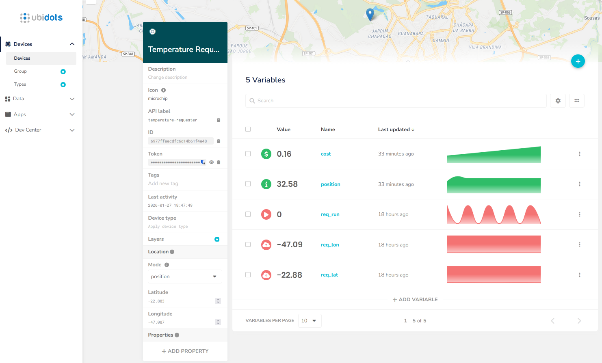 |
| :----------------------------------------------------------: |
| _Figura 3: Variáveis configuradas no dispositivo Ubidots_ |

#### Customizações do _Dashboard_

Para melhorar a usabilidade, realizei algumas customizações no _dashboard_:

1.  **_Sliders_ de Latitude/Longitude:** Como a área de cobertura dos sensores é pequena (apenas a região de Campinas/SP), os valores padrão de 0 a 100 dos _sliders_ seriam inúteis. Limitei os ranges para a faixa específica de operação (ex: Latitude de -22.81° a -22.91°) com passo de 0.001°. Também posicionei o _slider_ de latitude na vertical e o de longitude na horizontal para remeter aos eixos de um mapa.
2.  **Gatilho (`req_run`):** O Ubidots usa um componente de _Switch_ (0 ou 1). Para o sistema, o valor numérico não importa, apenas o evento da mudança de estado. Editei o controle para ocultar o texto e manter a mesma cor, funcionando visualmente como um botão de "Enviar".
3.  **Mapa:** A configuração deste _widget_ apresentou um desafio técnico significativo, exigindo a leitura detalhada da documentação oficial.
    * _Desafio:_ O _widget_ não utiliza uma hierarquia de variáveis simples. Ele exige que a latitude e a longitude sejam passadas como propriedades dentro de um objeto `context`, que por sua vez fica dentro da variável de valor (`value`) da temperatura.
    * _Solução:_ Essa estrutura JSON complexa teve que ser montada manualmente via JavaScript no fluxo do Node-RED para que o pino fosse renderizado corretamente no mapa.
    * _Marcadores de Referência:_ Para dar contexto visual, criei dois dispositivos "fictícios" no Ubidots (CPQD e FIAP) apenas para exibir marcadores estáticos no mapa.

| 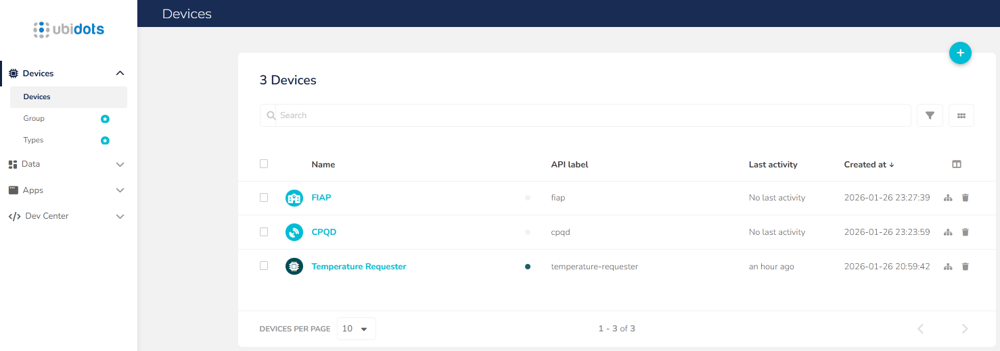 |
| :----------------------------------------------------------: |
| _Figura 4: Dispositivos auxiliares criados para referência visual_ |

Abaixo, o detalhe do mapa com os marcadores de referência (antena vermelha para CPQD e prédio para FIAP):

| 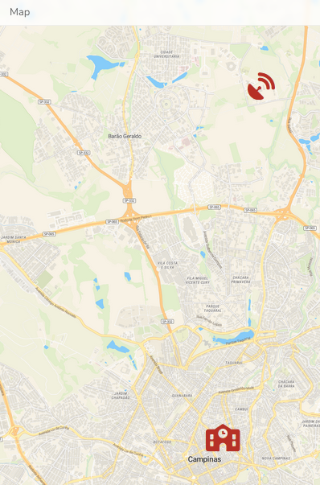 |
| :----------------------------------------------------------: |
| _Figura 5: Detalhe dos marcadores customizados no mapa_ |

| 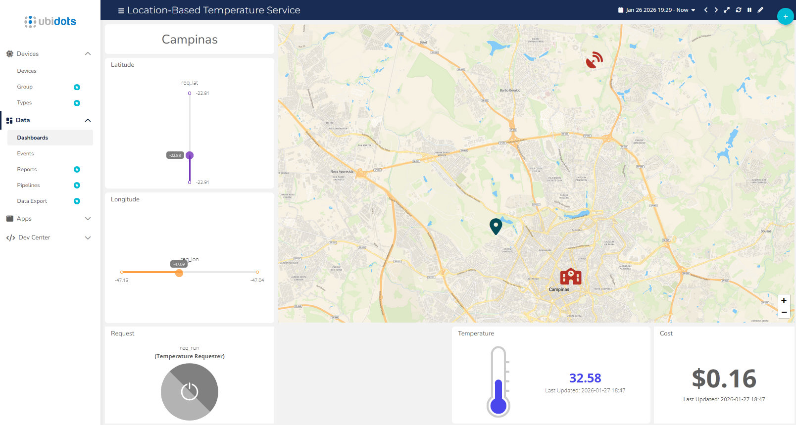 |
| :--------------------------------------------: |
|   _Figura 6: Dashboard completo de requisição_          |

### 3. Aplicação Node-RED (Integração e Lógica)

O Node-RED é o coração do sistema. Ele é responsável por centralizar a lógica que não poderia ser executada nem nos sensores nem no _dashboard_.

Também criei um _dashboard_ administrativo no próprio Node-RED para visualizar os dados brutos e zerar os dados dos sensores e o custo.

| 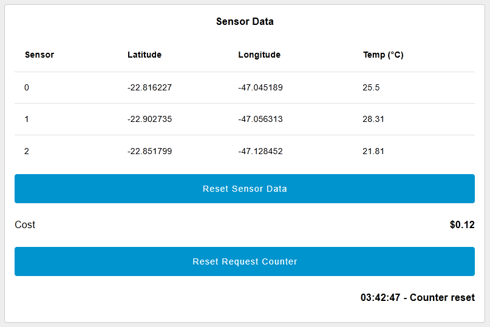 |
| :----------------------------------------------: |
|   _Figura 7: Dashboard administrativo no Node-RED_ |

A lógica do fluxo foi dividida em partes para facilitar o entendimento.

| 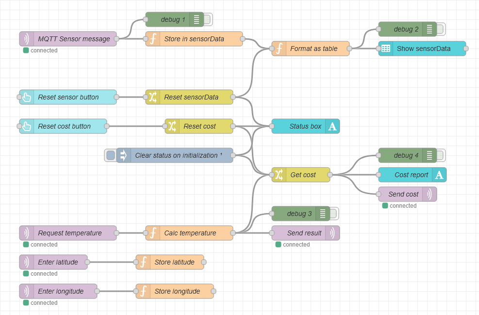 |
| :-------------------------------------------------: |
|   _Figura 8: Fluxo completo no Node-RED_            |

#### Gerenciamento de Estado (Armazenamento de Dados)

| 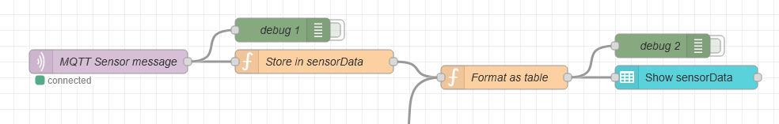 |
| :----------------------------------------------------------: |
|   _Figura 9: Fluxo de armazenamento de dados_                |

Sempre que um dado de sensor novo chega no _broker_ MQTT, ele é lido pelo Node-RED e armazenado em uma
variável chamada `sensorData` do tipo vetor. Em seguida, a variável `sensorData` é formatada e
apresentada em uma tabela.

O código javascript do nó `Store in sensorData` está abaixo. Podemos ver que ele armazena os dados
em `flow['sensorData']`.

```javascript
// The topic comes in as ".../sensor/1", ".../sensor/2", etc.
// We split the string to get the ID "1", "2", or "3"
var sensorID = msg.topic.split("/").at(-1);

// We get the current list of sensors from memory (or create an empty one)
var sensors = flow.get('sensorData') || {};

// We save the payload (lat, lon, temp) into this object
sensors[sensorID] = msg.payload;

// Write it back to memory
flow.set('sensorData', sensors);

// We don't return anything because this is just storage.
msg.payload = true;
return msg;
```

Para exibir esses dados no _Dashboard_ do Node-RED, o nó `Format as table` transforma esse objeto de estado em um _array_, que é o formato exigido pelo _widget_ de tabela:

```javascript
var sensors = flow.get('sensorData') || {};
var tableArray = [];

// Loop through each sensor ID ("1", "2", "3"...)
// and push the object into the array
for (var id in sensors) {
    if (sensors.hasOwnProperty(id)) {
        var data = sensors[id];

        tableArray.push({
            "Sensor": id,
            "Latitude": data.lat,
            "Longitude": data.lon,
            "Temp (°C)": data.temp
        });
    }
}

// The user interface widget expects data in msg.payload
msg.payload = tableArray;
return msg;
```

#### Lógica de Aplicação (Cálculo e Custo)

| 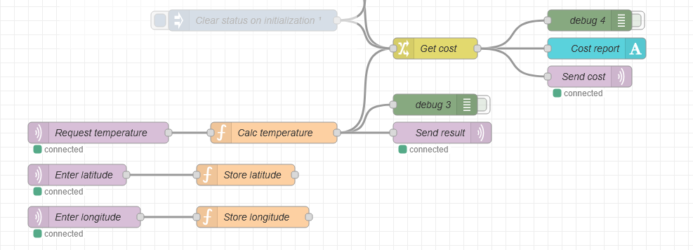 |
| :----------------------------------------------------------: |
| _Figura 10: Detalhe do fluxo de cálculo_ |

O Node-RED monitora as variáveis de requisição do Ubidots. Quando a Latitude ou Longitude é alterada, o Node-RED armazena os dados.

Código do nó `Store latitude`:
```javascript
flow.set('requested_latitude', msg.payload);
```

Código do nó `Store longitude`:
```javascript
flow.set('requested_longitude', msg.payload);
```

Quando o gatilho `req_run` é alterado, o nó de cálculo consome os dados armazenados na etapa anterior.

A lógica matemática utiliza a **Equação Geral do Plano** definida pelos três sensores no espaço.

> **Nota:** As funções JavaScript complexas, como o cálculo vetorial abaixo, foram geradas com auxílio de ferramenta de IA e validadas durante os testes.

O código também recalcula o custo e formata a mensagem a ser enviada para o Ubidots.

Código do nó `Calc temperature`:
```javascript
var sensors = flow.get('sensorData');

if (!sensors || !sensors["0"] || !sensors["1"] || !sensors["2"]) {
    msg.payload = { error: "Data still unavailable. Try again in a few minutes" };
    return msg;
}

// ------------------------------
// THE GEOMETRY (Plane Equation)
// ------------------------------

// Get the User's requested location
var requestedX = flow.get('requested_latitude');
var requestedY = flow.get('requested_longitude');

if (!requestedX || !requestedY) {
    msg.payload = { error: "Missing latitude or longitude" };
    return msg;
}

// We define our 3 points (x=lat, y=lon, z=temp)
// Point 1
var x0 = sensors["0"].lat;
var y0 = sensors["0"].lon;
var z0 = sensors["0"].temp;

// Point 2
var x1 = sensors["1"].lat; 
var y1 = sensors["1"].lon; 
var z1 = sensors["1"].temp;

// Point 3
var x2 = sensors["2"].lat; 
var y2 = sensors["2"].lon; 
var z2 = sensors["2"].temp;

// Calculate 2 Vectors (V1 = P2-P1, V2 = P3-P1)
var v1x = x1 - x0; var v1y = y1 - y0; var v1z = z1 - z0;
var v2x = x2 - x0; var v2y = y2 - y0; var v2z = z2 - z0;

// Calculate Normal Vector (Cross Product: V1 x V2)
// This gives us the coefficients (a, b, c) for the plane equation: ax + by + cz + d = 0
var a = (v1y * v2z) - (v1z * v2y);
var b = (v1z * v2x) - (v1x * v2z);
var c = (v1x * v2y) - (v1y * v2x);

// Solve for Z (Temperature) at the target (x, y)
// Formula: z = z0 - ( a*(x - x0) + b*(y - y0) ) / c

var estimatedTemp = 0;

if (c === 0) {
     // This happens if points are colinear (straight line) - cannot form a plane
     node.warn("Error: Sensors are in a straight line, cannot calculate plane.");
     estimatedTemp = null;
} else {
     var dx = requestedX - x0;
     var dy = requestedY - y0;
     estimatedTemp = z0 - ( (a * dx) + (b * dy) ) / c;
}

// Increase de cost
var pricePerRequest = 0.01;
var cost = flow.get('cost') || 0;
cost += pricePerRequest;
cost = Number(cost.toFixed(2)); // avoid precision errors
flow.set('cost', cost);


// Create the response message for the MQTT publish
msg.payload = {
    "position": {
        "value": estimatedTemp,
        "context": {
            "lat": requestedX,
            "lng": requestedY
        },
    }
};

return msg;
```

#### Inicialização e Reset

| 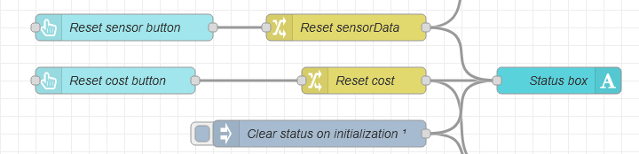 |
| :----------------------------------------------------------: |
| _Figura 11: Fluxo de reset administrativo_ |

Botões no _dashboard_ do Node-RED permitem limpar as variáveis `sensorData` e `cost`, facilitando a reinicialização dos testes sem precisar reiniciar o container Docker.

### Mapeamento de Tópicos MQTT

A tabela abaixo lista as mensagens MQTT utilizadas.

| **_Broker_** | **Publicador (Origem)** | **Subscritor (Destino)** | **Tópico** | **Exemplo de mensagem** | **Descrição** |
| ---------- | ----------- | - | - | - | - |
| MQTTx | Sensor ESP32 | Node-RED | _\<M>_`sensor/`_\<id>_ | `{"lat": -22.902735, "lon": -47.056313, "temp": 28.31}` | Dados dos sensores |
| Ubidots | Ubidots (_Slider_ V) | Node-RED | _\<U>_`/temperature-requester/req_lat/lv` | `-22.851` | Latitude da requisição |
| Ubidots | Ubidots (_Slider_ H) | Node-RED | _\<U>_`/temperature-requester/req_lon/lv` | `-47.094` | Longitude da requisição |
| Ubidots | Ubidots (Botão) | Node-RED | _\<U>_`/temperature-requester/req_run/lv` | `1` | Gatilho da requisição, note que seu valor não importa |
| Ubidots | Node-RED  | Ubidots (Mapa) | _\<U>_`/temperature-requester` | `{"position": {"value": 23.88, "context": {"lat": -22.851, "lng": -47.094}}` | Resposta da requisição |
| Ubidots | Node-RED  | Ubidots (_Display_) | _\<U>_`/temperature-requester/cost` | `3.14` | Custo |

**Nota:**
  * _\<id>_ se refere à identificação do sensor, que pode ser `0`, `1` ou `2`.
  * _\<M>_ se refere ao prefixo `IoT-Embarcados/akira/entrega/2`, usado no MQTTx.
  * _\<U>_ se refere ao prefixo `/v1.6/devices/`, usado no Ubidots.

Para se conectar ao servidor Ubidots, é necessário usar o token de acesso do dispositivo. Esse token
é inserido no lugar do _username_ e a senha é deixada em branco.

### Documentação
Este relatório foi elaborado em Markdown no VS Code e transformado em PDF com o plugin "Markdown PDF". O diagrama em blocos foi feito no [Draw.io](https://www.drawio.com/) e exportado para a pasta `docs`.

---

## Procedimentos de Teste e Resultados

Recomenda-se seguir a ordem abaixo para validar o funcionamento do sistema e comprovar a integração entre as partes.

### Obtendo os Arquivos

Digite os comandos abaixo em um terminal:
```bash
git clone https://github.com/cakira/IoT-Embarcados/
cd IoT-Embarcados/entregavel_2
```

### Carregar o Node-RED

**Pré-requisito:** Docker instalado.

1.  **Instalação de dependências (Primeira execução):**
    É necessário instalar o plugin _FlowFuse Dashboard_ no volume do Docker:
    ```bash
    docker run -it --rm -p 1880:1880 \
        --mount type=bind,src=$PWD/data_node_red,dst=/data \
        --entrypoint /bin/bash \
        nodered/node-red:4.1.3 \
        -c "cd /data && npm install @flowfuse/node-red-dashboard@1.30.2"
    ```

    | 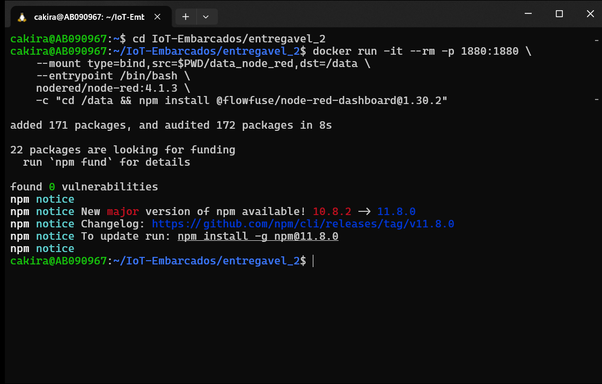 |
    | :----------------------------------------------------------: |
    | _Figura 12: Instalação das dependências via terminal_ |

2.  **Execução do Serviço:**
    ```bash
    docker run -it --rm -p 1880:1880 \
        --mount type=bind,src=$PWD/data_node_red,dst=/data \
        nodered/node-red:4.1.3
    ```
    **Nota sobre Versões:**
    O comando acima utiliza a tag `nodered/node-red:4.1.3`, que é a versão específica na qual este projeto foi validado. Caso deseje utilizar a versão mais recente do Node-RED, substitua `4.1.3` por `latest` no comando.

    | 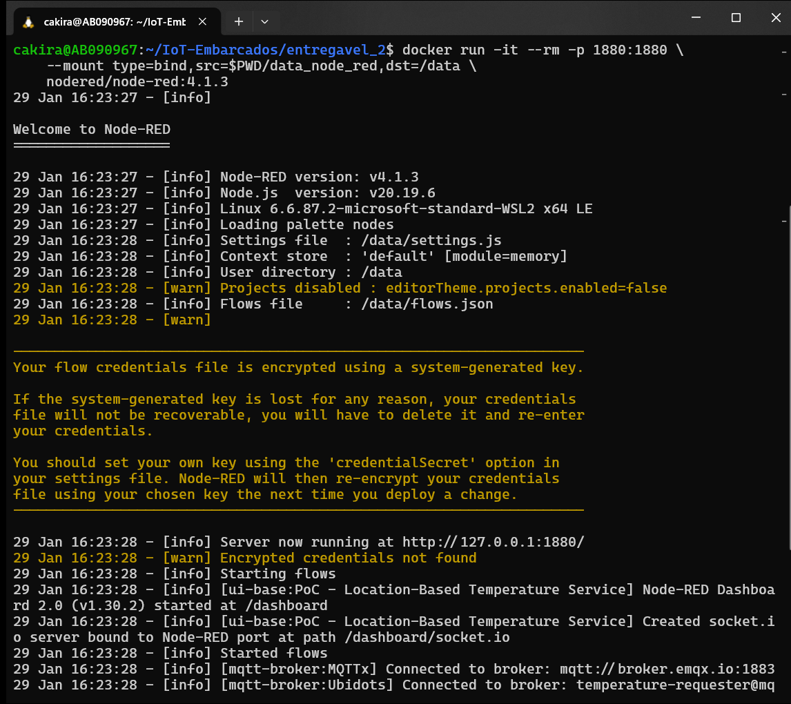 |
    | :----------------------------------------------------------: |
    | _Figura 13: Execução do container Node-RED_ |

3.  Acesse <http://127.0.0.1:1880/dashboard>. Inicialmente ele estará vazio, aguardando dados.

    | 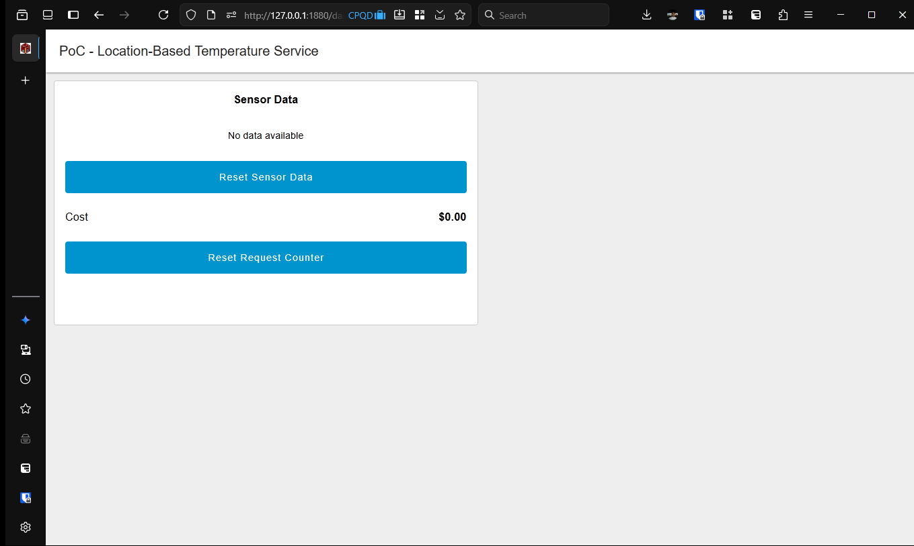 |
    | :----------------------------------------------------------: |
    | _Figura 14: Estado inicial do Dashboard (vazio)_ |

4.  Opcionalmente, a visão de fluxos pode ser acessada em <http://127.0.0.1:1880>:

    | 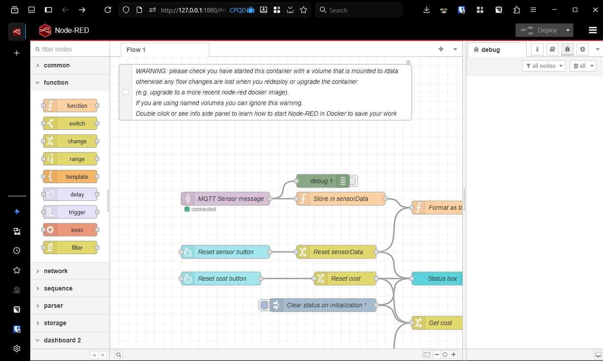 |
    | :----------------------------------------------------------: |
    | _Figura 15: Fluxos carregados corretamente_ |

### Simular o ESP32 (Wokwi)

1.  No VS Code, abra a pasta do projeto.
2.  Posicione as chaves do _DIP-Switch_ para o **ID 0** (`OFF`, `OFF`).
3.  Inicie a simulação. Confirme o envio MQTT na porta serial.

    | 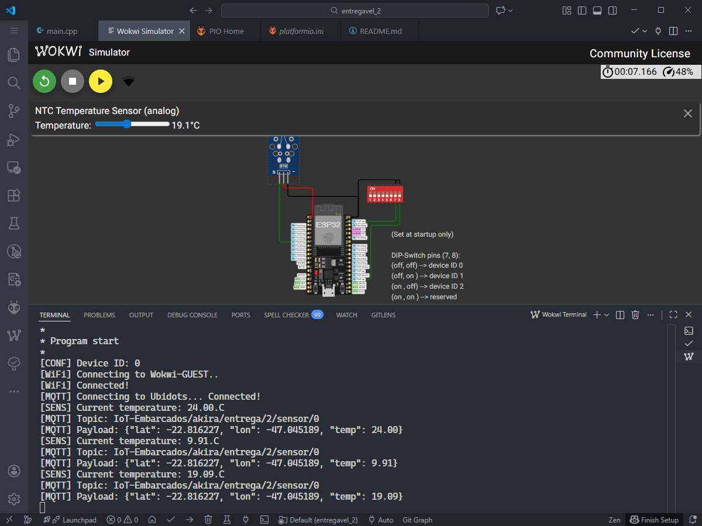 |
    | :----------------------------------------------------------: |
    | _Figura 16: Simulação Wokwi com logs seriais_ |

4.  Repita para o **ID 1** (`OFF`, `ON`) e **ID 2** (`ON`, `OFF`).
5.  _Verificação:_ Abra o _dashboard_ do Node-RED e confirme se os dados estão chegando. Abaixo, a evolução do _dashboard_ conforme os sensores são ligados.

    | 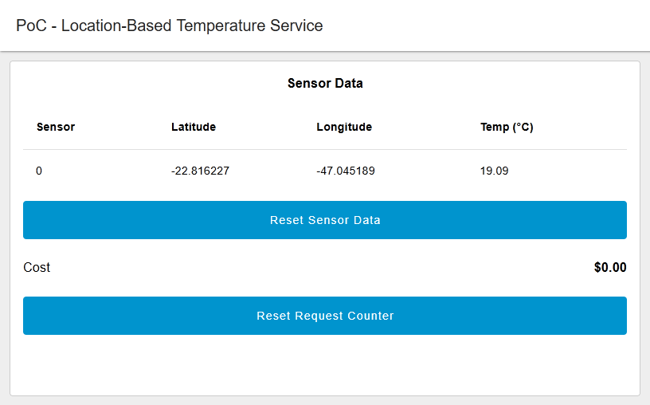 |
    | :----------------------------------------------------------: |
    | _Figura 17: Dashboard recebendo o primeiro sensor_ |

    | 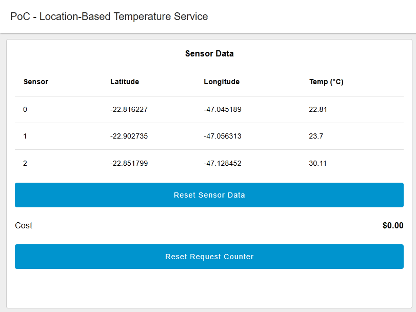 |
    | :----------------------------------------------------------: |
    | _Figura 18: Dashboard com todos os sensores online_ |

### Solicitar uma Temperatura (Ubidots)

Como a conta gratuita do Ubidots não permite compartilhar _dashboards_, os passos abaixo descrevem a validação na interface criada:

1.  Use o _slider_ vertical para selecionar uma latitude.
2.  Use o _slider_ horizontal para selecionar uma longitude.
3.  Clique no botão redondo (Gatilho) para enviar a requisição.
4.  Observe o resultado:
    1. A localização aparece no mapa com um pino azul.
    2. A temperatura calculada aparece no _widget_ de termômetro.
    3. O custo é atualizado (incremento de $0,01).

| 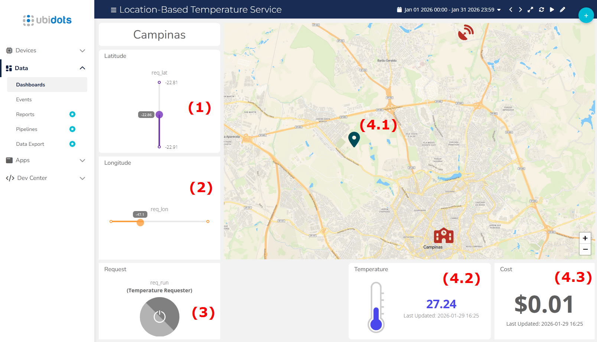 |
| :----------------------------------------------------------: |
|   _Figura 19: Resultado da requisição no Ubidots_             |

Após realizar 7 requisições distintas, o Ubidots traça o histórico dos pontos no mapa e o custo acumulado sobe para $0,07:

| 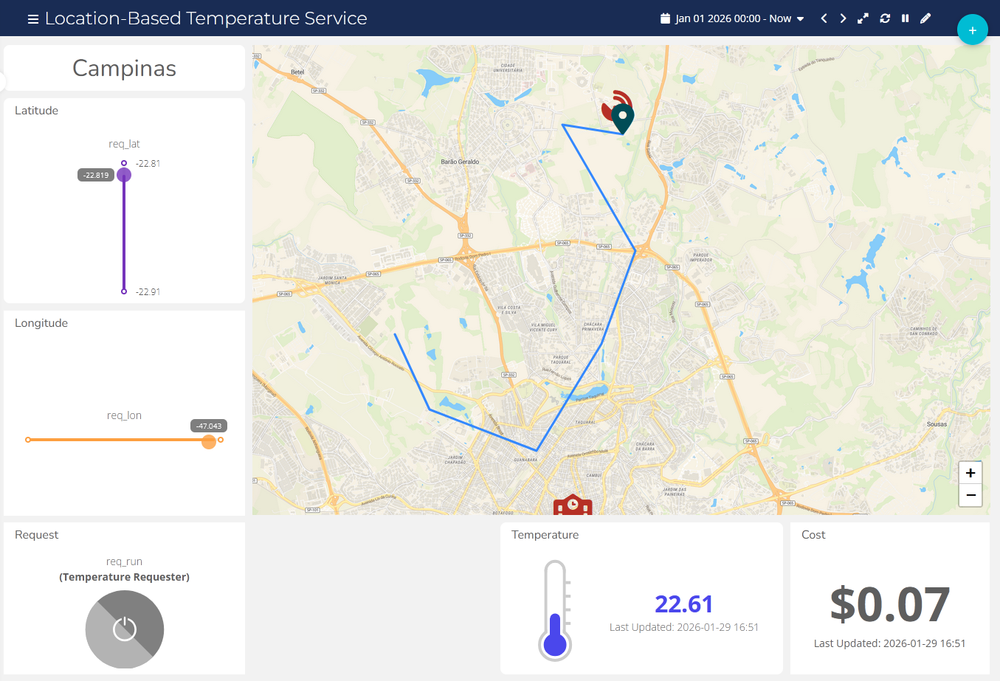 |
| :----------------------------------------------------------: |
|   _Figura 20: Histórico de requisições e custo acumulado_     |

**Validação Cruzada (Debug):**
Para provar que os dados do Node-RED chegaram corretamente no Ubidots, podemos comparar as mensagens de debug com o resultado no _dashboard_ acima:

| 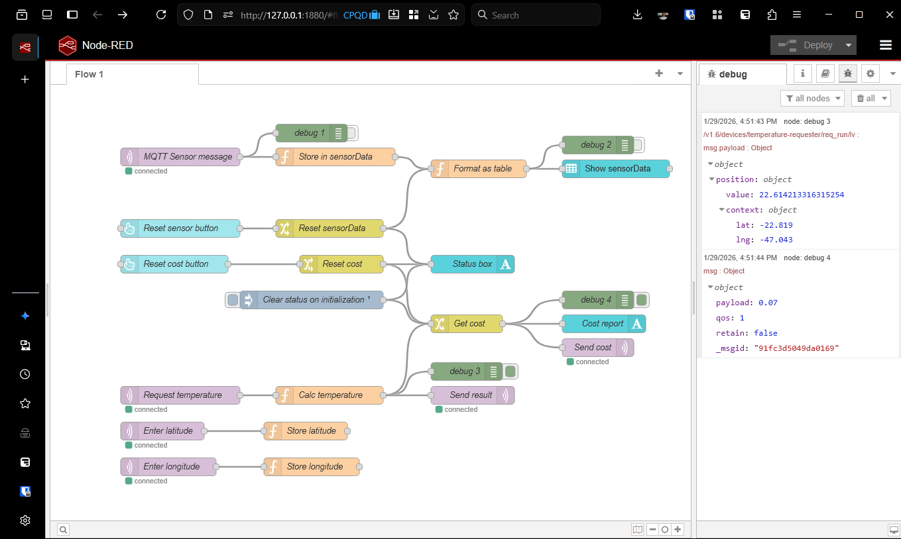 |
| :----------------------------------------------------------: |
| _Figura 21: Validação cruzada (Logs Node-RED vs. Dashboard Ubidots)_ |

### Reset dos Dados

Para provar o controle administrativo, clicamos nos botões "Reset Sensor Data" e "Reset Request Counter" no Node-RED.
* **No Node-RED:** A tabela de sensores é limpa.
* **No Ubidots:** O display de custo volta a zero imediatamente.

| 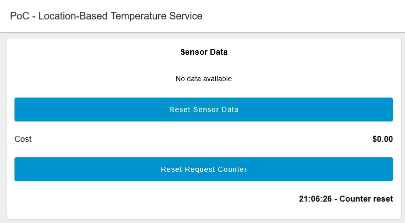 |
| :----------------------------------------------------------: |
|   _Figura 22: Limpeza da tabela no Node-RED_ |

| 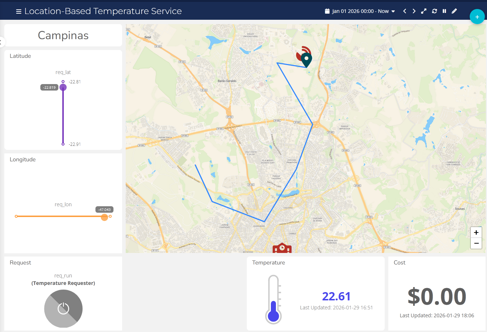 |
| :----------------------------------------------------------: |
|   _Figura 23: Validação do reset de custo no Ubidots_         |

---

## Validação dos Requisitos

**Legenda:**
* ✅ - indica que a tarefa foi cumprida integralmente
* ✔️ - indica que a tarefa foi cumprida parcialmente

| Status | Tarefa do Enunciado | Observação |
| :---: | :--- | :--- |
| ✅ | Criar device no Ubidots (2-4 variáveis) | Device "Requester" criado com 5 variáveis. |
| ✅ | Configurar _dashboard_ com _widgets_ | _Sliders_, Mapa, Indicadores e Botão (customizado). |
| ✅ | Publicar telemetria MQTT via Wokwi | 3 sensores ESP32 simulados. |
| ✅ | Integração MQTT (_Broker_ → Ubidots) | Realizada via Node-RED. |
| ✅ | Validar atualização dos dados | Validado via comparação visual (Figura 21) e logs. |
| ✅ | Inserir prints do _dashboard_ | Figuras incluídas no relatório. |
| ✔️ | Documentação formal da arquitetura | Este documento (sem capa). |
| ✅ | Vídeo de demonstração | Entregue separadamente. |

---

## Possíveis Melhorias

Algumas limitações foram notadas durante o desenvolvimento e poderiam ser abordadas em uma versão futura:

* **Testes Automatizados:** Inclusão de testes unitários para a lógica de cálculo.
* **Segurança:** Uso de MQTTS (TLS) para criptografar a comunicação.
* **Validação dos Dados:** A aplicação deve validar se os dados que chegam no servidor são válidos antes de prosseguir, sobretudo para os dados de cliente.
* **Escalabilidade:** O cálculo atual limita-se a 3 sensores formando um plano. Poderia ser expandido para usar mais sensores e com a troca do algoritmo.
* **Curvatura da Terra:** Os cálculos atuais assumem um plano cartesiano simples. Para distâncias maiores, seria necessário considerar a curvatura da Terra.
* **Tratamento de Erro:** O Ubidots não exibe mensagem de erro caso o usuário tente uma requisição sem que os sensores estejam online (o erro aparece apenas no debug do Node-RED).
* **Múltiplos Clientes:** Atualmente, o sistema está limitado a um cliente apenas.
* **Troca de Grandezas:** Eventualmente, pode ser interessante trabalhar com outras grandezas, como umidade do ar, ou poluição atmosférica.

## Conclusão

Este projeto cumpriu três objetivos principais:

1.  **Requisitos Acadêmicos:** A atividade foi entregue conforme o enunciado, integrando sensores, _broker_ e _dashboard_ na nuvem.
2.  **Aprendizado Técnico:** O uso do **Node-RED** foi fundamental e cumpriu o objetivo didático. Não tendo grande familiaridade com a ferramenta, pude aprender a:
    * Instanciar e configurar um container Docker com a versão mais recente do Node-RED.
    * Instalar plugins externos, tanto via _Palette Manager_ quanto via linha de comando (`npm install`).
    * Configurar nós de entrada e saída MQTT.
    * Integrar lógica complexa via nós de função JavaScript (com auxílio de IA, mas com revisão manual do código).
    * Gerenciar o armazenamento de dados em memória utilizando variáveis de contexto de fluxo (`flow.get` / `flow.set`).
    * Utilizar controle de versão (Git) para gerenciar o projeto do Node-RED.
3.  **Prova de Conceito (PoC):** Apesar das simplificações (como posições fixas e cálculo planar), o sistema demonstra funcionalmente um serviço de valor agregado, onde o dado bruto é transformado em informação útil e monetizável.
