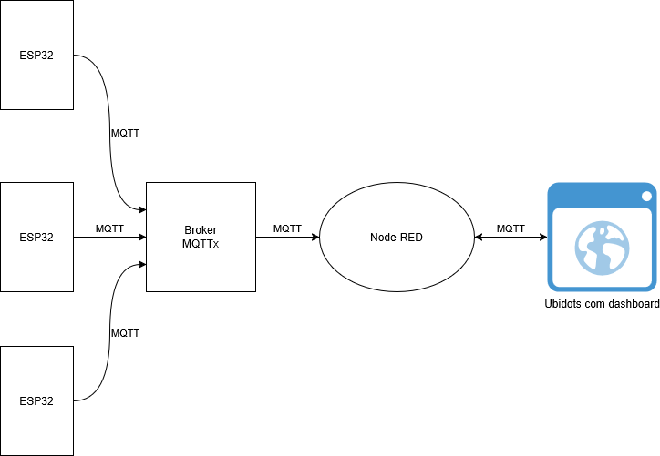
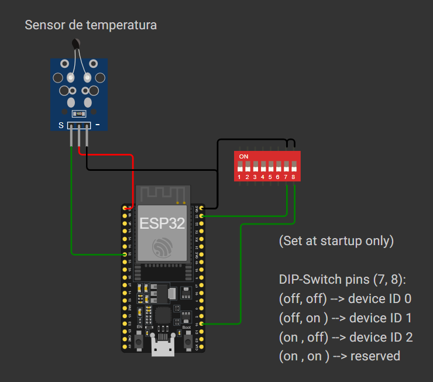
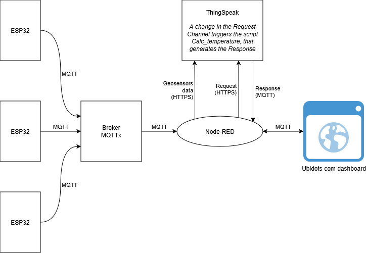
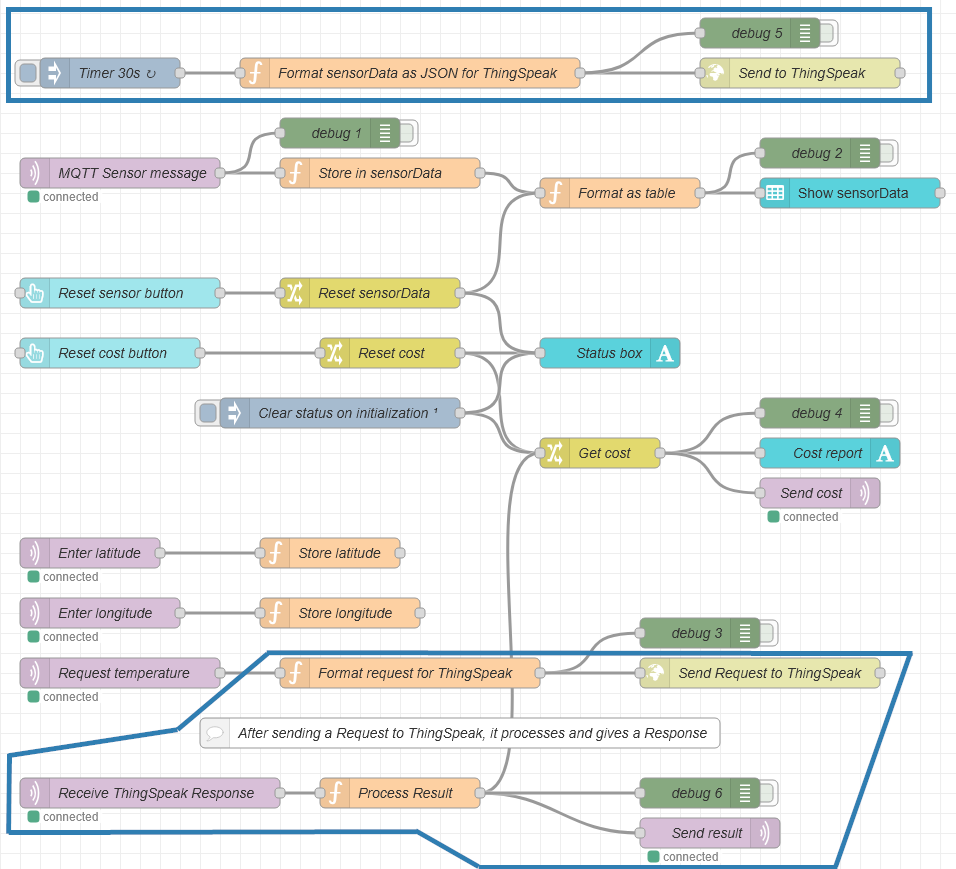
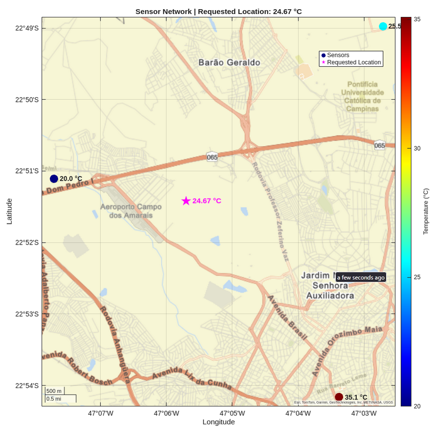

# PoC: Serviço de Temperatura por Localização

_Por: Cleber Akira Nakandakare_

- [PoC: Serviço de Temperatura por Localização](#poc-serviço-de-temperatura-por-localização)
  - [Introdução](#introdução)
    - [Escopo da Atividade](#escopo-da-atividade)
  - [Arquitetura da Solução](#arquitetura-da-solução)
    - [Conceito: Serviço de Temperatura sob Demanda](#conceito-serviço-de-temperatura-sob-demanda)
    - [Diagrama de Blocos](#diagrama-de-blocos)
  - [Implementação](#implementação)
    - [1. Coleta de Dados (Dispositivos de Borda)](#1-coleta-de-dados-dispositivos-de-borda)
    - [2. Interface com Cliente (Ubidots)](#2-interface-com-cliente-ubidots)
    - [3. Processamento Central e Lógica (Node-RED)](#3-processamento-central-e-lógica-node-red)
      - [A. Armazenamento de Dados](#a-armazenamento-de-dados)
      - [B. Cálculo da Temperatura (Geometria Analítica)](#b-cálculo-da-temperatura-geometria-analítica)
      - [C. Inicialização e Reset](#c-inicialização-e-reset)
    - [Mapeamento de Tópicos MQTT](#mapeamento-de-tópicos-mqtt)
    - [Ferramentas de Documentação](#ferramentas-de-documentação)
  - [Guia de Execução e Testes](#guia-de-execução-e-testes)
    - [Pré-requisitos e Download](#pré-requisitos-e-download)
    - [Inicialização do Node-RED (Docker)](#inicialização-do-node-red-docker)
    - [Simulação dos Sensores (ESP32/Wokwi)](#simulação-dos-sensores-esp32wokwi)
    - [Operação do Sistema (Ubidots)](#operação-do-sistema-ubidots)
    - [Reinicialização e Limpeza de Dados](#reinicialização-e-limpeza-de-dados)
  - [Validação dos Requisitos](#validação-dos-requisitos)
  - [Limitações e Trabalhos Futuros](#limitações-e-trabalhos-futuros)
  - [Conclusão](#conclusão)
- [Apêndice: Entrega 3 - Migração da Lógica de Processamento para o ThingSpeak](#apêndice-entrega-3---migração-da-lógica-de-processamento-para-o-thingspeak)
  - [Nova Arquitetura e Fluxo de Dados](#nova-arquitetura-e-fluxo-de-dados)
  - [Estrutura dos Dados e Integração](#estrutura-dos-dados-e-integração)
    - [Tabela Complementar de Comunicação (Node-RED ↔ ThingSpeak)](#tabela-complementar-de-comunicação-node-red--thingspeak)
  - [Implementação da Lógica no ThingSpeak](#implementação-da-lógica-no-thingspeak)
  - [Análise Crítica: Benefícios e Limitações](#análise-crítica-benefícios-e-limitações)

---

## Introdução

Este documento detalha a solução desenvolvida para a "Atividade Entregável 2" do curso de **IoT em Sistemas Embarcados (2025/2026)**. O projeto consiste na criação de um sistema completo de telemetria e controle via MQTT, integrando dispositivos simulados, um *broker* de mensagens e um *dashboard* na nuvem.

O código-fonte completo e os artefatos do projeto estão disponíveis no repositório:
<https://github.com/cakira/IoT-Embarcados/tree/main/entregavel_2>.

### Escopo da Atividade

**Ferramentas:** Wokwi + HiveMQ (ou outro broker MQTT) + Plataforma Ubidots + Sistema desejado para
Integração

> 1. Criar device no Ubidots (2 a 4 variáveis de telemetria a critério do estudante) - Pode
>    reutilizar a Atividade 1 mas tente ser criativo melhorando o projeto anterior.
> 2. Configurar dashboard com widgets para o device criado - DICA: Como o Dashboard tem limite de
>    10 Variaveis, pode usar variaveis de contexto para aumentar esse limite. Veja Aulas da Semana 6
> 3. No Wokwi, publicar telemetria MQTT em algum Broker (MQTTx, HiveMQ, Mosquito, etc)
> 4. No Ubidots, configurar integração MQTT usando Token do device/variáveis para consumir dados do
>    Broker (via bridge, plugin, ou fluxo suportado pela plataforma, pode ser criado um outro
>    sistema com ESP32 como retransmissor como ex. da Semana 7).
> 5. Validar se os dados do device estão atualizando no dashboard do Ubidots - Gere um relatorio
>    (pode ser capturado do monitor serial) da origem dos dados e comparar com o resultado final.
>    Acrescente na documentação.
> 6. Inserir print do dashboard atualizado na documentação
> 7. Criar uma documentação adequada mostrando um rascunho simples da arquitetura, objetivo do
>    projeto, descrição geral do sistema, explicação de cada componente, seu fluxo de interação
>    entre eles, descrição das variaveis de publicação e subscrição e conclusoes. Faça um documento
>    formal com capa, titulo, indices, etc.
> 8. Fazer um pequeno video de poucos minutos mostrando o funcionamento dos sistemas, pode usar
>    captura de tela.

## Arquitetura da Solução

Para atender aos requisitos de forma didática e coerente com uma aplicação real, foi concebida uma arquitetura onde o Ubidots não apenas espelha dados brutos, mas atua como cliente de um serviço de valor agregado.

### Conceito: Serviço de Temperatura sob Demanda

O sistema simula um serviço onde o usuário solicita a temperatura estimada para uma coordenada geográfica específica. Diferente de um monitoramento passivo, o sistema opera da seguinte forma:

1.  Sensores distribuídos enviam dados brutos para um *broker* MQTT.
2.  O usuário seleciona uma localização no Ubidots.
3.  O sistema processa a requisição, realiza uma **interpolação espacial** baseada nos dados dos sensores vizinhos e retorna a temperatura estimada para aquele ponto.
4.  O serviço contabiliza um "custo" financeiro por requisição, simulando um modelo de cobrança.

Essa abordagem justifica a existência de um processamento intermediário (via Node-RED), evitando que o Ubidots apenas replique dados que o *broker* já possui.

### Diagrama de Blocos

A solução integra três ESP32 simulados (entrada de dados), a plataforma Node-RED (processamento central) e o Ubidots (interface final). O fluxo de comunicação é integralmente baseado no protocolo MQTT.

|  |
| :----------------------------------------------------------: |
|   _Figura 1: Diagrama em blocos da arquitetura proposta_    |

O Node-RED foi escolhido para realizar a integração e o processamento dos dados pela sua flexibilidade e facilidade didática na criação de fluxos de dados (_Low-code_).

## Implementação

O sistema divide-se em três macro-componentes: **Coleta de Dados**, **Interface com Cliente** e **Aplicação Node-RED**.

### 1. Coleta de Dados (Dispositivos de Borda)

A camada de borda é composta por três dispositivos ESP32 simulados no Wokwi. Cada dispositivo representa uma estação meteorológica fixa, enviando temperatura (lida via sensor NTC) e suas coordenadas geográficas a cada 2 segundos.

Como o simulador não possui módulo GPS, as localizações foram definidas via *firmware*, correspondendo a pontos reais de instituições de ensino/pesquisa:

| ID | Localização | Latitude | Longitude |
| :- | :---------- | :------- | :-------- |
| 0  | CPQD        | -22.8162 | -47.0451  |
| 1  | FIAP        | -22.9027 | -47.0563  |
| 2  | CTI         | -22.8517 | -47.1284  |

A identificação de cada sensor é configurada fisicamente através de um *DIP-switch* (chaves 7 e 8) lido apenas na inicialização do dispositivo, conforme ilustrado a seguir:

|  |
| :----------------------------------------------------------: |
|         _Figura 2: Configuração do ID via DIP-switch_          |

### 2. Interface com Cliente (Ubidots)

O Ubidots atua como a interface de solicitação do serviço. Foi criado um dispositivo virtual denominado _"Temperature Requester"_ contendo as variáveis de controle (inputs do usuário) e de resposta (outputs do sistema).

**Variáveis de Controle:**
* `req_lat` e `req_lon`: Coordenadas alvo da requisição.
* `req_run`: Gatilho (_trigger_) para disparar o cálculo.

**Variáveis de Resposta:**
* `cost`: Valor acumulado do serviço.
* `position`: Variável composta que armazena a temperatura estimada e o contexto geográfico para plotagem no mapa.

**Customizações do Dashboard:**
* **Sliders:** Configurados com limites precisos (ex: Lat -22.81° a -22.91°) e orientação (vertical para latitude, horizontal para longitude) para facilitar a seleção geográfica.
* **Mapa:** Implementado seguindo a documentação avançada de *widgets* do Ubidots. Para enriquecer a visualização, foram adicionados marcadores estáticos (Device CPQD e Device FIAP) servindo como referência visual para o usuário.

|  |
| :--------------------------------------------: |
|   _Figura 3: Interface de requisição e mapa_   |

### 3. Processamento Central e Lógica (Node-RED)

O Node-RED é o núcleo do sistema, responsável por receber os dados, executar a lógica e devolver as respostas. Ele assina os tópicos dos sensores e do Ubidots, executa o cálculo matemático e publica os resultados.

Foi desenvolvido um *dashboard* administrativo no Node-RED para monitoramento dos dados brutos e gestão do sistema (reset de custos e limpeza de dados).

|  |
| :-------------------------------------------------: |
|       _Figura 4: Fluxo completo no Node-RED_        |

A lógica foi segmentada em três blocos funcionais:

#### A. Armazenamento de Dados
Ao receber dados MQTT dos sensores, o fluxo extrai o ID do dispositivo e armazena o objeto JSON (`lat`, `lon`, `temp`) em uma variável de fluxo global `sensorData`. Isso garante que o sistema sempre tenha o "estado atual" de todos os sensores disponível para cálculo.

#### B. Cálculo da Temperatura (Geometria Analítica)
Quando o usuário aciona o gatilho no Ubidots, o nó `Calc temperature` executa a interpolação. A lógica baseia-se na **Equação Geral do Plano** determinada por três pontos no espaço 3D (onde X=Latitude, Y=Longitude, Z=Temperatura).

O algoritmo realiza os seguintes passos:
1.  Recupera a última leitura válida dos sensores 0, 1 e 2.
2.  Calcula os vetores diretores entre os pontos.
3.  Obtém o vetor normal através do produto vetorial.
4.  Resolve a equação para encontrar Z (temperatura) nas coordenadas (X, Y) solicitadas pelo usuário.
5.  Incrementa o contador de custo ($0,01 por requisição).

_Nota: O trecho de código JavaScript responsável por essa lógica pode ser consultado diretamente no arquivo `flows.json` ou na documentação original._

#### C. Inicialização e Reset
Fluxos auxiliares garantem a limpeza das variáveis globais e o reset dos contadores via botões administrativos, enviando feedback visual ao painel de controle.

### Mapeamento de Tópicos MQTT

A comunicação entre os componentes segue a topologia definida na tabela abaixo.

| Origem | Destino | Tópico | Descrição |
| :--- | :--- | :--- | :--- |
| **Sensor ESP32** | Node-RED | `.../sensor/<id>` | Telemetria bruta (Lat, Lon, Temp) |
| **Ubidots (Slider)** | Node-RED | `.../req_lat/lv` | Latitude solicitada |
| **Ubidots (Slider)** | Node-RED | `.../req_lon/lv` | Longitude solicitada |
| **Ubidots (Botão)** | Node-RED | `.../req_run/lv` | Gatilho de execução |
| **Node-RED** | Ubidots (Mapa) | `.../temperature-requester` | JSON com temperatura e contexto geo |
| **Node-RED** | Ubidots (Display)| `.../cost` | Valor monetário acumulado |

> **Legendas:**
> * Prefixos MQTTx: `IoT-Embarcados/akira/entrega/2`
> * Prefixos Ubidots: `/v1.6/devices/temperature-requester`

### Ferramentas de Documentação

Este relatório foi elaborado em Markdown no VS Code, utilizando as seguintes ferramentas:
* [Markdown All in One](https://marketplace.visualstudio.com/items?itemName=yzhang.markdown-all-in-one): (extensão do VS Code) para formatação geral e geração automática do sumário.
* [Markdown PDF](https://marketplace.visualstudio.com/items?itemName=yzane.markdown-pdf): (extensão do VS Code) para exportação do documento final.
* [draw.io](https://www.drawio.com/): (aplicativo/site online) para a produção dos diagramas de blocos.

---

## Guia de Execução e Testes

Siga os procedimentos abaixo para reproduzir o ambiente e validar o funcionamento.

### Pré-requisitos e Download
* Docker instalado.
* VS Code com extensão Wokwi e PlatformIO.
* Conta no Ubidots (Educational/Stem).

Clone o repositório do projeto:
```bash
git clone https://github.com/cakira/IoT-Embarcados/
cd IoT-Embarcados/entregavel_2
```

### Inicialização do Node-RED (Docker)

1.  **Instalação de dependências (Primeira execução):**
    Execute o comando abaixo para instalar o *FlowFuse Dashboard* no volume persistente:
    ```bash
    docker run -it --rm -p 1880:1880 \
        --mount type=bind,src=$PWD/data_node_red,dst=/data \
        --entrypoint /bin/bash \
        nodered/node-red:4.1.3 \
        -c "cd /data && npm install @flowfuse/node-red-dashboard@1.30.2"
    ```

2.  **Execução do Serviço:**
    Inicie o container Node-RED:
    ```bash
    docker run -it --rm -p 1880:1880 \
        --mount type=bind,src=$PWD/data_node_red,dst=/data \
        nodered/node-red:4.1.3
    ```

3.  Acesse o painel administrativo em: <http://127.0.0.1:1880/dashboard>.

### Simulação dos Sensores (ESP32/Wokwi)

1.  No VS Code, abra a pasta do projeto.
2.  Configure o **Sensor 0**: Ajuste o *DIP-Switch* simulado para `OFF, OFF`.
3.  Inicie a simulação (Play). Verifique no console serial a conexão MQTT e envio de dados.
4.  Repita o processo para o **Sensor 1** (`OFF, ON`) e **Sensor 2** (`ON, OFF`), preferencialmente abrindo instâncias simultâneas do VS Code ou alternando a execução.
5.  *Verificação:* Confirme se os três sensores aparecem na tabela do *dashboard* do Node-RED.

### Operação do Sistema (Ubidots)

Devido às limitações de compartilhamento da conta gratuita do Ubidots, os testes devem ser feitos replicando os *widgets* descritos na seção de implementação.

1.  No *dashboard* do Ubidots, defina uma coordenada usando os *sliders* de Latitude e Longitude.
2.  Clique no botão de gatilho.
3.  **Resultado Esperado:**
    * O mapa atualiza o marcador para a nova posição.
    * O *widget* de temperatura exibe o valor calculado.
    * O contador de custo é incrementado.

|  |
| :----------------------------------------------------------: |
|           _Figura 5: Visualização do resultado no mapa_            |

### Reinicialização e Limpeza de Dados
Para validar as funções administrativas, acesse o *dashboard* do Node-RED e utilize os botões **Reset Sensor Data** e **Reset Request Counter**. Verifique se a tabela é limpa e se o custo no Ubidots retorna a zero.

---

## Validação dos Requisitos

Abaixo, a matriz de rastreabilidade entre o enunciado da atividade e a solução entregue:

| Status | Tarefa do Enunciado | Observação |
| :---: | :--- | :--- |
| ✅ | Criar device no Ubidots (2-4 variáveis) | Criado device "Requester" com 5 variáveis. |
| ✅ | Configurar dashboard com widgets | Sliders, Mapa, Indicadores e Switch implementados. |
| ✅ | Publicar telemetria MQTT via Wokwi | 3 instâncias de ESP32 simuladas. |
| ✅ | Integração MQTT (Broker → Ubidots) | Realizada via Node-RED (Aplicação Central). |
| ✅ | Validar atualização dos dados | Comprovada via comparação de logs e screenshots. |
| ✅ | Inserir prints do dashboard | Figuras incluídas ao longo do documento. |
| ✔️ | Documentação formal da arquitetura | Documento estruturado (sem capa formal). |
| ✅ | Vídeo de demonstração | Entregue em anexo/separado. |

---

## Limitações e Trabalhos Futuros

Como Prova de Conceito (PoC), o sistema atinge seus objetivos, mas apresenta oportunidades de evolução para um produto final:

* **Segurança:** Implementação de MQTTS (SSL/TLS) e autenticação de usuários para proteger o acesso aos dados e ao controle.
* **Escalabilidade e Algoritmos:** Substituição do cálculo de plano (limitado a 3 pontos) por algoritmos de interpolação que suportem *n* sensores, como a Ponderação pelo Inverso da Distância (IDW).
* **Precisão Geográfica:** Adoção de fórmulas que considerem a curvatura da Terra (fórmula de Haversine ou elipsoide) para aumentar a precisão em distâncias maiores.
* **Resiliência:** Tratamento de erros de comunicação com o *broker* e feedback visual no Ubidots caso o serviço de cálculo esteja indisponível.

## Conclusão

Este projeto cumpriu integralmente os requisitos da disciplina de IoT, demonstrando a integração prática entre dispositivos de borda, lógica de nuvem e interface de usuário.

O uso do Node-RED como centralizador da lógica provou-se uma escolha arquitetural acertada, permitindo abstrair a complexidade matemática da interpolação e controlar a regra de cobrança, enquanto o Ubidots foi utilizado naquilo que oferece de melhor: visualização de dados e interação com o usuário final. Além da validação técnica, o desenvolvimento proporcionou domínio sobre a orquestração de containers Docker e fluxos MQTT avançados.

# Apêndice: Entrega 3 - Migração da Lógica de Processamento para o ThingSpeak

Como uma evolução da Prova de Conceito original (Entrega 2), a arquitetura do sistema foi refatorada nesta Entrega 3 para transferir a responsabilidade de armazenamento histórico e o processamento matemático do Node-RED para o **ThingSpeak** (plataforma IoT da MathWorks).

Neste novo cenário, o Node-RED atua primariamente como um agregador de dados (*gateway* e roteador) e gerencia o envio das informações, enquanto o motor do MATLAB embutido no ThingSpeak assume a execução dos cálculos matemáticos.

## Nova Arquitetura e Fluxo de Dados

Para viabilizar a integração sem esbarrar nas restrições do plano gratuito do ThingSpeak (que permite apenas 8 campos de dados por canal e impõe um tempo mínimo de 15 segundos entre cada envio), a arquitetura adotou o empacotamento dos dados de múltiplos nós sensores em um único pacote JSON. O sistema foi estruturado em três canais no ThingSpeak:

1. **Canal *Geosensors*:** Armazena o estado atual de toda a rede de sensores. O Node-RED agrega as leituras individuais dos três ESP32 e envia um único pacote de dados para o *Field 1* deste canal.
2. **Canal *Request*:** Recebe as solicitações de cálculo vindas do usuário. O Node-RED gera um identificador único (`request_id`) e envia junto com as coordenadas alvo.
3. **Canal *Response*:** Armazena o resultado do cálculo. O Node-RED assina este canal via MQTT, recebendo a resposta de forma assíncrona assim que o processamento matemático no ThingSpeak é concluído, e então repassa o valor final ao Ubidots.

|  |
| :----------------------------------------------------------: |
|   _Figura 6: Diagrama da arquitetura atualizada integrando o motor do ThingSpeak_    |

## Estrutura dos Dados e Integração

Para contornar o limite de campos e o tempo mínimo entre envios imposto pelo ThingSpeak, o Node-RED agrupa os dados de telemetria recebidos via MQTT em um objeto JSON unificado. 

Abaixo está o exemplo exato do formato do *payload* enviado via HTTP POST para o canal *Geosensors*:

```json
{
  "sensors": [
    {
      "id": "0",
      "lat": -22.8162,
      "lon": -47.0451,
      "temp": 24.5
    },
    {
      "id": "1",
      "lat": -22.9027,
      "lon": -47.0563,
      "temp": 26.2
    },
    {
      "id": "2",
      "lat": -22.8517,
      "lon": -47.1284,
      "temp": 23.8
    }
  ]
}
```

### Tabela Complementar de Comunicação (Node-RED ↔ ThingSpeak)

Complementando o mapeamento de tópicos da Entrega 2, a comunicação com o ecossistema ThingSpeak ocorre utilizando uma topologia mista (HTTP para escrita em lote e MQTT para leitura orientada a eventos):

| Origem | Destino | Protocolo / Endpoint | Descrição |
| :--- | :--- | :--- | :--- |
| **Node-RED** | ThingSpeak (Canal *Geosensors*) | HTTP POST `/update` | Envio periódico do *payload* JSON com o estado consolidado da rede de sensores. |
| **Node-RED** | ThingSpeak (Canal *Request*) | HTTP POST `/update` | Envio de uma nova requisição contendo o `request_id`, latitude e longitude alvo. |
| **ThingSpeak** | Node-RED (Listener) | MQTT Sub `channels/3272805/subscribe` | Node-RED assina o canal de resposta para ser notificado assim que o cálculo for concluído na nuvem. |

|  |
| :-------------------------------------------------: |
| _Figura 7: Novo fluxo Node-RED orquestrando requisições HTTP e subscrições MQTT_ |

## Implementação da Lógica no ThingSpeak

A inteligência do sistema foi implementada utilizando os aplicativos nativos do ThingSpeak. O fluxo de execução funciona da seguinte maneira:

* **Gatilho (*React App*):** Configurado para monitorar inserções de dados. Sempre que o Node-RED posta uma nova coordenada no canal *Request*, o aplicativo aciona automaticamente o script de análise no MATLAB.
* **Processamento Matemático (*MATLAB Analysis*):** O script lê o JSON armazenado no canal *Geosensors* e extrai a matriz de dados. Em seguida, calcula a distância euclidiana entre a coordenada solicitada e todos os sensores disponíveis na rede, **selecionando dinamicamente os 3 sensores mais próximos**. Com estes três pontos espaciais, aplica-se o produto vetorial para encontrar a Equação do Plano, estimando a temperatura local. O resultado, atrelado ao `request_id` original, é escrito no canal *Response*.
* **Visualização de Dados (*MATLAB Visualizations*):** Foram criadas visualizações programadas em MATLAB para auditoria direta no painel do ThingSpeak:
  * Uma tabela dinâmica de dados no canal *Geosensors* que extrai as informações do JSON e exibe os sensores ativos.

|  |
| :------------------------------------------------------------: |
| _Figura 8: Tabela dinâmica gerada no canal Geosensors_         |

  * Um mapa de dispersão geográfica no canal *Response* que plota a posição dos sensores, utilizando uma escala de cores baseada em temperatura, juntamente com a localização exata solicitada pelo usuário.

|  |
| :----------------------------------------------------------: |
| _Figura 9: Mapa de dispersão geográfica gerado no canal Response_ |

## Análise Crítica: Benefícios e Limitações

A transferência do processamento para o ThingSpeak trouxe vantagens conceituais, mas introduziu novos desafios que impactam o desempenho do sistema em um cenário de tempo real.

**Benefícios:**
* **Capacidade Matemática e Escalabilidade:** Embora o JavaScript (no Node-RED) seja excelente para manipulação de mensagens, operações matemáticas pesadas com grandes matrizes podem comprometer seu desempenho. Utilizar o motor do MATLAB permite implementar algoritmos de ordenação espacial complexos de forma nativa e altamente otimizada, escalando facilmente caso a rede cresça para dezenas de sensores.
* **Modularidade e Separação de Interfaces:** É interessante mencionar que as únicas adaptações sistêmicas necessárias ocorreram no Node-RED. A configuração do painel no Ubidots permaneceu totalmente intacta, assim como o código-fonte essencial dos ESP32 (que só demandaria ajustes caso houvesse interesse em ter mais do que 3 sensores na rede). O fato de as extremidades do sistema não precisarem ser alteradas indica que a rigorosa separação de interfaces na implementação original (sem o ThingSpeak) foi uma escolha afortunada.
* **Depuração Visual:** Os scripts de mapa e tabela integrados ao painel simplificam a visualização geoespacial para validação de calibração e cobertura da rede de sensores.

**Limitações e Problemas Encontrados:**
* **Aumento Expressivo da Latência:** Esta foi a principal regressão arquitetural observada nesta entrega. A exigência de um tempo mínimo de 15 segundos entre envios de dados (devido ao plano gratuito), somada ao tempo de disparo do gatilho interno e à execução do script MATLAB na nuvem, adicionou atrasos consideráveis ao ciclo de resposta. O sistema perdeu a reatividade instantânea presente na Entrega 2, tornando a interface no Ubidots visivelmente mais lenta.
* **Complexidade Sistêmica e Dependência:** A arquitetura passou a depender de mais um serviço em nuvem de terceiros. A complexidade aumentou consideravelmente devido à necessidade de empacotar dados brutos, lidar com requisições assíncronas utilizando identificadores gerados dinamicamente (`request_id`) e gerenciar múltiplas chaves de autenticação de API.

Em suma, a integração demonstrou na prática a delegação do processamento matemático para o ThingSpeak na nuvem, o que abre uma enorme gama de análises matemáticas possíveis. Contudo, a lentidão imposta pelas limitações do serviço gratuito impede não apenas a obtenção rápida de respostas, como também trabalhar com mais do que 4 demandas por minuto.
